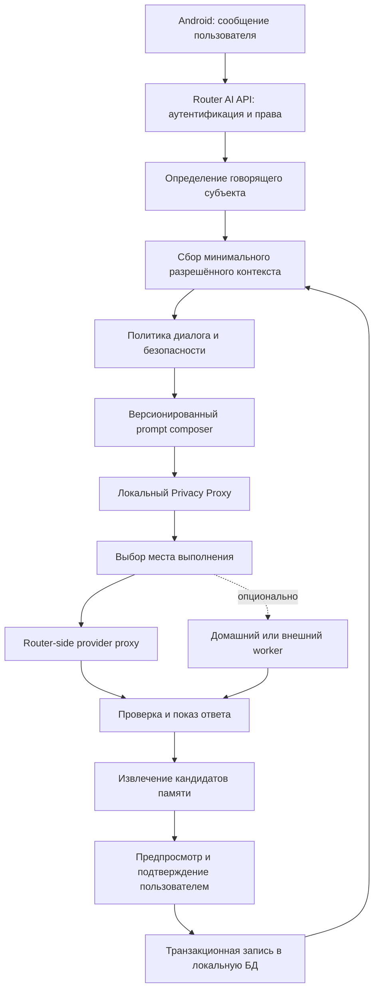

# Разработка ИИ-помощника Sheepfold

<!-- §aiarch1 -->

Эта папка — единая точка входа для проектирования `Sheepfold - AI Support`: будущих модулей, хранилища, правил диалога и порядка реализации. Здесь описывается согласованная архитектура. Каждая новая идея сразу записывается в подходящий тематический файл. Если ей нет подходящего места, нужно создать узкий документ и добавить его в карту ниже.

Документы не означают, что долговременная AI-память уже реализована. До появления кода это проектный контракт и защита от несовместимых реализаций в разных чатах.

## Карта документов

| Файл | Ответственность |
|---|---|
| [`current-implementation.ru.md`](current-implementation.ru.md) | Точная карта уже работающего кода и его границы |
| [`modules.ru.md`](modules.ru.md) | Предметные модули и границы их ответственности |
| [`data-model.ru.md`](data-model.ru.md) | Будущая схема БД, происхождение сведений, хранение и удаление |
| [`memory-lifecycle-and-forgetting.ru.md`](memory-lifecycle-and-forgetting.ru.md) | Три слоя памяти, версионирование и аккуратное забывание по просьбе субъекта (§aiforgt) |
| [`consciousness-architecture-notes.ru.md`](consciousness-architecture-notes.ru.md) | Парковка архитектурных рекомендаций и точка возврата к проектированию сознания помощника (§aiconsc) |
| [`dialogue-policy.ru.md`](dialogue-policy.ru.md) | Тактичность, опасные убеждения, религия и психологическая безопасность |
| [`caregiver-emotion-regulation.ru.md`](caregiver-emotion-regulation.ru.md) | Помощь родителю в страхе, гневе и после воспитательного срыва (§aicare1) |
| [`child-trusted-assistant.ru.md`](child-trusted-assistant.ru.md) | Доверенный детский ИИ-собеседник, границы конфиденциальности и будущий safety-протокол (§aichild) |
| [`parent-conversation-after-safety-signal.ru.md`](parent-conversation-after-safety-signal.ru.md) | Заготовка большой библиотеки сценариев для безопасного разговора родителя после экстренного сигнала (§aichild) |
| [`tactful-persistence-and-human-help.ru.md`](tactful-persistence-and-human-help.ru.md) | Соразмерное возвращение к опасной теме и добровольная консультация живого специалиста (§aiescal) |
| [`legal-risk-and-restorative-response.ru.md`](legal-risk-and-restorative-response.ru.md) | Правовой риск ребёнка, отсутствие скрытого информирования и восстановительные сценарии проступков (§ailegal) |
| [`regional-risk-context.ru.md`](regional-risk-context.ru.md) | Проверяемые региональные факторы риска, страх обращения за помощью и безопасное признание (§aireg01) |
| [`external-integrations.ru.md`](external-integrations.ru.md) | Календарь, заметки, SMS и иные будущие внешние адаптеры |
| [`privacy-proxy-and-external-compute.ru.md`](privacy-proxy-and-external-compute.ru.md) | Локальное маскирование, псевдонимы и необязательный внешний вычислительный worker (§aiexec1, §aimask1) |
| [`mediator-and-initiative.ru.md`](mediator-and-initiative.ru.md) | Будущие команды ИИ, два режима подтверждения, медиатор и инициатива (§aimed01) |
| [`adaptive-surveys-and-hypotheses.ru.md`](adaptive-surveys-and-hypotheses.ru.md) | Добровольные анкеты и строгие исправляемые рабочие гипотезы (§aisurv1) |
| [`interaction-styles.ru.md`](interaction-styles.ru.md) | Параметры формы ответа без ослабления safety и приватности (§aistyle1) |
| [`implementation-roadmap.ru.md`](implementation-roadmap.ru.md) | Этапы реализации, миграции и обязательные тесты |

## Связанные исследовательские документы

- [`../ai-assistant-charter.ru.md`](../ai-assistant-charter.ru.md) — ценности и запреты помощника;
- [`../ai-device-ownership.ru.md`](../ai-device-ownership.ru.md) — ранняя идея определения принадлежности устройств;
- [`../ai-family-profiles.ru.md`](../ai-family-profiles.ru.md) — исторический концепт профилей, который нельзя реализовывать в обход новой модели данных;
- [`../ai-child-safety.ru.md`](../ai-child-safety.ru.md) — исследовательская идея анализа рисков, а не готовая архитектура;
- [`../private-activity-logs.ru.md`](../private-activity-logs.ru.md) и [`../site-activity-logs.ru.md`](../site-activity-logs.ru.md) — отдельные контракты журналов.

Эти файлы содержат полезные идеи, но не имеют приоритета над текущей архитектурой, приватностью и принципом подтверждаемой памяти.

Системные промпты остаются в [`../ai-assistant-prompt-for-support-parent/`](../ai-assistant-prompt-for-support-parent/). Общие продуктовые требования остаются в [`../product-requirements.md`](../product-requirements.md), а правила передачи контекста — в [`../ai-context-sharing.ru.md`](../ai-context-sharing.ru.md). Эта папка не дублирует их, а соединяет в будущую реализацию.

## Общая схема взаимодействия

Ключевой принцип: ответ ИИ и запись памяти — разные операции. Модель может предложить карточку субъекта, события, симптома или суждения, но не должна незаметно превращать вывод в сохранённый факт.

## Как соединяются модули

1. `requestGateway` проверяет токен, роль, rate limit и capability AI-версии роутера.
2. `subjectRegistry` связывает диалог с `knownSubjects`, не используя MAC/IP как личность человека.
3. Предметные хранилища возвращают только подходящие записи с источником, сроком актуальности и разрешением на использование.
4. `contextAssembler` формирует минимальный контекст и показывает пользователю чувствительные категории перед отправкой внешнему провайдеру.
5. `dialoguePolicy` задаёт ограничения тона и безопасности, но не переписывает факты и не подделывает религиозный или профессиональный авторитет.
6. `privacyProxy` удаляет секреты, псевдонимизирует и минимизирует payload до любого внешнего перехода (§aimask1).
7. `taskRouter` оставляет лёгкую работу на роутере либо отправляет ограниченную задачу необязательному worker; worker не получает обратную карту алиасов и не управляет роутером (§aiexec1).
8. `providerProxy` обращается к выбранной модели только с роутера; ключ провайдера не попадает в Android (§xaji0y6, §dpbhsah).
9. `memoryCandidateExtractor` создаёт предложения записей с provenance, но запись выполняет только `confirmationQueue` после нужного согласия.
10. `memoryRepository` сохраняет подтверждённые изменения одной транзакцией и пишет безопасный административный аудит без содержания чувствительных записей.

`mediatorEngine`, `actionPolicy`, `surveyEngine`, `familyInsight`, `stylePolicy` и `initiativePolicy` являются отдельными модулями, а не дополнительными обязанностями одного огромного prompt. Их контракты находятся в [`mediator-and-initiative.ru.md`](mediator-and-initiative.ru.md), [`adaptive-surveys-and-hypotheses.ru.md`](adaptive-surveys-and-hypotheses.ru.md) и [`interaction-styles.ru.md`](interaction-styles.ru.md).

## Правило обновления документации

- новая идея — сразу в соответствующий тематический файл;
- новая область, которая не помещается в текущую схему, — в отдельный сфокусированный файл с обязательной ссылкой из карты документов;
- согласованная модель данных — в `data-model.ru.md`;
- новая ответственность или связь — в `modules.ru.md` и в схему этого README;
- правило поведения ИИ — в `dialogue-policy.ru.md` и затем в версионированный prompt;
- команды, автоматический режим и инициативы — в `mediator-and-initiative.ru.md` (§aimed01);
- анкеты и рабочие гипотезы — в `adaptive-surveys-and-hypotheses.ru.md` (§aisurv1);
- параметры формы ответа — в `interaction-styles.ru.md` (§aistyle1);
- сроки, перенос между слоями и просьба забыть — в `memory-lifecycle-and-forgetting.ru.md` (§aiforgt);
- архитектурные рекомендации и вопросы следующего этапа — в `consciousness-architecture-notes.ru.md` (§aiconsc);
- решение о порядке реализации — в `implementation-roadmap.ru.md`;
- изменение инварианта получает §-тег в [`../dev/tag-map.md`](../dev/tag-map.md).

Не поддерживать параллельные противоречивые описания. Одна идея должна иметь одно каноническое место, а остальные документы должны ссылаться на него.
