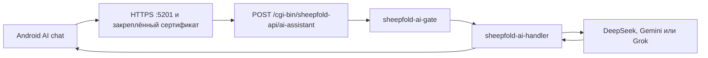

# Реализованная архитектура ИИ-помощника

<!-- §aiimpl1 -->

Последняя сверка с кодом: 17 июля 2026 года.

Этот документ описывает только то, что уже присутствует в текущей ветке. Будущая долговременная память, предметные модули и схема БД описаны в соседних документах и не считаются реализованными.

## Граница вариантов продукта

- Каноническая SDK-матрица создаёт четыре роутерных release-файла: Standard и AI Support в формате IPK для OpenWrt 24.10 и в формате apk-tools v3 APK для OpenWrt 25.12. Внутри все варианты имеют единое имя установленного пакета, поэтому переход выполняется как обновление с сохранением UCI-конфига (§prodvar, §owrtci1).
- Обычный роутерный пакет физически не содержит AI gateway, handler, runtime-промпты, AI-маршрут и журнал активности для ИИ.
- Родительский и детский Android APK едины для обеих редакций роутерного пакета. Они показывают AI-интерфейс только после положительного capability от роутера.
- Родитель получает `capabilities.aiAssistant` из авторизованного `/router-info`. Детское приложение получает отдельные флаги из `/client-status`.

Границу пакетов централизованно формирует [`../../scripts/sheepfold_variants.py`](../../scripts/sheepfold_variants.py). Быстрые IPK использует [`../../scripts/build-test-ipk.py`](../../scripts/build-test-ipk.py), а канонические релизы собирает [GitHub Actions](../github-actions-openwrt-build.ru.md) официальным OpenWrt SDK. Границу payload проверяют [`../../tests/productVariants.test.mjs`](../../tests/productVariants.test.mjs) и [`../../tests/openWrtVariantFeed.test.mjs`](../../tests/openWrtVariantFeed.test.mjs).

## Работающий путь запроса

### HTTP dispatcher

[`sheepfold-api`](../../package/luci-app-sheepfold-family-internet-control/root/www/cgi-bin/sheepfold-api) принимает только `POST`, ограничивает общий поток запросов, отклоняет тело больше 16 KiB и последовательно вызывает gate и handler.

### Проверка доступа

[`sheepfold-ai-gate`](../../package/luci-app-sheepfold-family-internet-control/root/usr/libexec/sheepfold/sheepfold-ai-gate):

- проверяет, что ИИ включён на роутере;
- сам определяет MAC по IP клиента через DHCP leases или ARP и не доверяет присланной роли либо идентификатору;
- находит зарегистрированное устройство и сверяет его числовой ID;
- всегда отклоняет устройство из чёрного списка устройств;
- для родителя проверяет Bearer-токен вместе с ID и MAC привязанного админского устройства;
- для ребёнка требует маркер детского APK, актуальную версию родительского согласия и принадлежность личной группе;
- не разрешает детскому клиенту запрашивать диагностику, журнал, аккаунт либо переопределять провайдера;
- применяет отдельный лимит запросов на устройство, состояние которого хранится в `/tmp`.

### Формирование запроса провайдеру

[`sheepfold-ai-handler`](../../package/luci-app-sheepfold-family-internet-control/root/usr/libexec/sheepfold/sheepfold-ai-handler):

- берёт провайдера, модель, URL, API-ключ и версию промпта только из UCI роутера;
- загружает неизменяемый runtime-промпт из `/usr/share/sheepfold/prompts/<role>/<version>/system.txt` (§prmvers);
- различает проверенные роли `parent` и `child`;
- по явным флагам администратора может добавить краткое состояние роутера и последние записи журнала;
- перед добавлением контекста маскирует MAC, IP и похожие на секреты значения;
- отправляет запрос в DeepSeek и Grok через OpenAI-совместимый формат, а в Gemini через `generateContent`;
- использует доступный на OpenWRT HTTP-клиент: `uclient-fetch`, `wget` либо `curl`.

API-ключи сейчас хранятся в UCI и доступны root-пользователю роутера. Они не попадают в APK, QR сопряжения, capability, журнал или обычный экспорт. Отдельное шифрованное хранилище ключей на роутере пока не реализовано.

## LuCI

Основной экран [`overview.js`](../../package/luci-app-sheepfold-family-internet-control/htdocs/luci-static/resources/view/sheepfold/overview.js) уже позволяет выбрать DeepSeek, Gemini или Grok, настроить модель и ключ, а также выбрать версию родительского промпта. AI Support добавляет соответствующие UCI defaults и runtime-файлы; Standard-вариант удаляет их при сборке.

Настройка будущего автоматического режима `ai_auto_actions`, строгий исполнитель команд и согласованная двухуровневая схема журналов пока не реализованы. Их нельзя добавлять в runtime только потому, что соответствующие контракты уже подробно описаны в планах (§aimed01, §aiact01).

Отдельный файл [`ai.js`](../../package/luci-app-sheepfold-family-internet-control/htdocs/luci-static/resources/view/sheepfold/ai.js) содержит раннюю форму AI-настроек, но в текущем menu.d не подключён как самостоятельная страница. Его нельзя считать вторым действующим интерфейсом; перед дальнейшей разработкой его нужно либо подключить и синхронизировать с `overview.js`, либо удалить как дубликат.

## Родительский Android-клиент

[`AiAssistantClient.kt`](../../android/app/src/main/java/app/sheepfold/android/router/AiAssistantClient.kt):

- обращается только к HTTPS endpoint роутера с уже закреплённым TLS fingerprint;
- передаёт Bearer-токен, числовой ID и MAC привязанного админского устройства;
- отправляет роль `parent`; backend всё равно проверяет её самостоятельно;
- разбирает ответы DeepSeek/Grok, Gemini и обёрнутый ответ Sheepfold;
- не хранит API-ключ внешнего провайдера.

[`ProductFeature.kt`](../../android/app/src/main/java/app/sheepfold/android/ui/main/ProductFeature.kt) скрывает вкладку без `capabilities.aiAssistant=true`. Текущий экран отправляет только набранный вопрос: переключатели отправки диагностики и журнала в UI ещё не реализованы и всегда передают `false`.

## Детский Android-клиент

[`AiRepository.kt`](../../android-child/app/src/main/java/com/example/sheepfoldchild/data/AiRepository.kt) отправляет вопрос через тот же роутерный endpoint без административного токена. Он передаёт ограниченную локальную историю чата и безопасное резюме собственного статуса. Роутер повторно проверяет устройство, согласие родителя и личную группу при каждом запросе.

Вкладка показывается только при `childAiAvailable=true`. Если ИИ разрешён, но личная группа не назначена, интерфейс показывает причину блокировки, а backend всё равно отклоняет отправку.

## Runtime-промпты

В роутерный пакет AI Support уже входят:

- `parent/v1/system.txt`;
- `parent/v2/system.txt`;
- `child/v1/system.txt`.

UCI-поля `parent_ai_prompt_version` и `child_ai_prompt_version` выбирают каталог. Новая редакция должна добавляться новой версией, а не незаметно менять уже проверенный текст.

## Что ещё не реализовано

- долговременная память о субъектах, событиях, здоровье, отношениях, религиозном контексте и личных суждениях;
- справочник региональных факторов риска и модуль безопасного обращения за помощью (§aireg01);
- модуль саморегуляции родителя и восстановления после воспитательного срыва (§aicare1);
- доверенный детский safety-протокол, защищённая конфиденциальность и безопасная маршрутизация при агрессии родителя (§aichild);
- уровни тактичной настойчивости, `safetyConcernPolicy` и консультация живого специалиста через внешний сервис (§aiescal);
- `legalRiskPolicy`, восстановительные сценарии и безопасная маршрутизация при уголовно-правовом риске ребёнка (§ailegal);
- SQLite-схема и `memoryRepository`;
- извлечение кандидатов памяти и подтверждение каждой записи;
- отдельные согласия, просмотр, исправление, срок хранения и каскадное удаление AI-памяти;
- серверная история диалога;
- полноценный Privacy Proxy, alias vault, локальная NER-модель и preview фактически отправляемого payload;
- домашний или публичный внешний вычислительный worker (§aiexec1, §aimask1);
- полноценный экран preview контекста в родительском APK;
- изменение настроек Sheepfold по предложению ИИ;
- исполнитель строгой схемы AI-действий, backend-preview и проверенный результат применения;
- `ai_auto_actions` с разрешёнными без второго вопроса только существующим расписанием и обычной пользовательской группой;
- глобальное и индивидуальное согласие на журнал активности, родительское юридическое предупреждение и агрегированный AI-анализ без показа сырого журнала;
- адаптивные добровольные анкеты, стили общения, инициатива и строгие внутренние гипотезы о собеседнике (§aisurv1, §aistyle1, §aiact01);
- календарь, заметки, SMS и официальные медицинские источники;
- production security review endpoint и проверка всех провайдеров на живом роутере.

Эти возможности нельзя описывать в пользовательском интерфейсе как работающие до появления кода и тестов.

## Текущие автоматические проверки

- [`aiProviderSettings.test.mjs`](../../tests/aiProviderSettings.test.mjs) — провайдеры, отсутствие неявного fallback, версии промптов и Grok;
- [`tokenDeviceBinding.test.mjs`](../../tests/tokenDeviceBinding.test.mjs) — привязка токена к ID и MAC устройства;
- [`apiRateLimit.test.mjs`](../../tests/apiRateLimit.test.mjs) — ограничение API;
- [`productVariants.test.mjs`](../../tests/productVariants.test.mjs) — физическая граница двух редакций в быстрых IPK и server-driven AI в двух Android APK;
- [`openWrtVariantFeed.test.mjs`](../../tests/openWrtVariantFeed.test.mjs) — та же граница в feed для официального OpenWrt SDK;
- [`openWrtBuildWorkflow.test.mjs`](../../tests/openWrtBuildWorkflow.test.mjs) — полная матрица IPK/OpenWrt APK и безопасная публикация release.

Эти тесты в основном проверяют структуру и контракты исходников. Они не заменяют проверку реального HTTPS, UCI, провайдеров и ограничений на OpenWRT-роутере.
