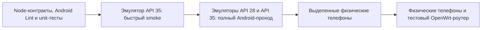

# Ручной стенд тестирования Android-приложений

<!-- §andlab1 -->

Этот документ описывает воспроизводимый стенд для родительского и детского APK
Sheepfold. Стенд запускается **только по явной команде**: при непосредственной
работе над Android-сценарием, перед передачей новых APK на проверку либо как часть
полного предрелизного прохода. Обычные `npm.cmd test`, `quality:changed` и CI не
скачивают system images и не запускают виртуальные телефоны.

## Зачем нужен гибридный стенд

Одного эмулятора недостаточно. Он хорошо воспроизводит Android API, lifecycle,
Compose UI, навигацию и ошибки сети, но не доказывает поведение камеры, SIM,
настоящего Wi-Fi, private MAC, OEM-ограничений фоновой работы и сопряжения через
реальный роутер. Поэтому стенд состоит из четырёх уровней:



| Уровень | Что ловит | Когда запускать | Чего не доказывает |
|---|---|---|---|
| Статические и unit-тесты | API-контракты, сериализацию, ресурсы, правила безопасности | при каждой профильной правке | Android runtime и геометрию экрана |
| `emulatorSmoke` API 35 | запуск APK, Compose semantics, первый экран | при прямой работе над Android UI/lifecycle | старую поддерживаемую версию и реальное железо |
| `emulatorFull` API 28/35 | нижнюю и верхнюю границы поддержки | перед выдачей APK и релизом | камеру, Wi-Fi, SIM и прошивки производителей |
| `physicalSmoke` | фактический Android runtime выбранного телефона | после правок камеры, разрешений, уведомлений, виджетов, биометрии | взаимодействие с роутером, если тот не участвует |
| Телефон + живой роутер | discovery, QR, TLS pin, токены, API и изменение таблиц LuCI | перед релизом и после изменения pairing/network contracts | поведение всех моделей телефонов и роутеров |

## Состав стенда

- Windows 10/11 с включённой аппаратной виртуализацией и Windows Hypervisor
  Platform (WHPX);
- JDK 17 и Android SDK из `tools/windows/setup.ps1`;
- Android Emulator и два отдельных AOSP x86_64 system image;
- AVD `SheepfoldLabApi28` для минимально поддерживаемого Android 9;
- AVD `SheepfoldLabApi35` для текущей целевой платформы;
- один или два выделенных физических Android-телефона без ценных данных;
- отдельный тестовый OpenWrt-роутер для сквозных pairing/Wi-Fi/API сценариев.

AVD запускаются последовательно, чтобы не занимать память двумя виртуальными
телефонами одновременно. Точный размер зависит от версии SDK, но перед первой
установкой разумно иметь не менее 12 ГБ свободного места. Google Play в базовые
AVD не входит: для Sheepfold важнее чистый AOSP runtime, а сценарии, зависящие от
Google Play Services, должны получить отдельный обоснованный профиль.

## Первичная настройка Windows

Сначала подготовить общий toolchain из корня репозитория:

```powershell
powershell -ExecutionPolicy Bypass -File tools\windows\setup.ps1 -Install -AcceptAndroidLicenses -AndroidSdkRoot "$env:LOCALAPPDATA\Android\Sdk"
```

Затем установить только проектные system images и AVD:

```powershell
npm.cmd run androidLab:setup -- -Install -AcceptAndroidLicenses
```

Команда скачивает официальные AOSP images API 28/35 и создаёт только два AVD с
именами Sheepfold. Она не удаляет существующие AVD. Явный `-RecreateAvds` может
пересоздать только `SheepfoldLabApi28` и `SheepfoldLabApi35`; посторонние AVD
скрипт не трогает. Сетевой сбой `sdkmanager` повторяется до пяти раз с паузой;
если все попытки исчерпаны, уже исправные SDK-компоненты не удаляются.

Проверка готовности без запуска эмулятора:

```powershell
npm.cmd run androidLab:doctor
```

Она проверяет SDK, JDK, WHPX и оба AVD. Для диагностики ускорения отдельно можно
выполнить:

```powershell
& "$env:LOCALAPPDATA\Android\Sdk\emulator\emulator.exe" -accel-check
```

## Профили запуска

Быстрый проход на API 35:

```powershell
npm.cmd run androidLab:smoke
```

Полный последовательный проход на API 28 и API 35:

```powershell
npm.cmd run androidLab:full
```

По умолчанию проверяются оба APK. Для одного приложения:

```powershell
npm.cmd run androidLab:smoke -- -AppScope parent
npm.cmd run androidLab:smoke -- -AppScope child
```

Для визуального наблюдения добавить `-ShowEmulator`. Для исследования состояния
после теста добавить `-KeepEmulator`; завершить такой AVD нужно вручную через
`adb -s emulator-5572 emu kill`. `-CollectBugreportOnFailure` создаёт большой
Android bugreport только при падении и потому не включён по умолчанию.

## Меню: переносы подписей

`app.sheepfold.android.ui.main.MenuLayoutTest` запускается точечно при изменении меню,
не в каждом обычном Node-прогоне. В пустой Activity он использует реальные компоненты
и переводы приложения, ширины 320/360/600 dp, масштаб шрифта 100/130/200% и обе темы.
Проверяется `TextLayoutResult`: нет разрыва слова между строками, обрезания и потери
перехода по ключу карточки. На широкой области остаётся несколько колонок.

Из корня репозитория сначала выполнить проверку исходников:

```powershell
node --test tests/androidParentManagement.test.mjs
```

Затем с JDK 17, настроенным Android SDK и кешем зависимостей собрать тестовые APK:

```powershell
$env:GRADLE_USER_HOME = Join-Path $env:USERPROFILE '.gradle'
.\android\gradlew.bat -p android :app:assembleDebug :app:assembleDebugAndroidTest --offline --no-daemon --max-workers=2
```

Только на согласованном тестовом телефоне/эмуляторе, заменив `PHONE_SERIAL` значением
из `adb devices -l` и разблокировав экран:

```powershell
$adb = Join-Path $env:ANDROID_HOME 'platform-tools\adb.exe'
& $adb -s PHONE_SERIAL install -r -t android/app/build/outputs/apk/debug/app-debug.apk
& $adb -s PHONE_SERIAL install -r -t android/app/build/outputs/apk/androidTest/debug/app-debug-androidTest.apk
& $adb -s PHONE_SERIAL shell am instrument -w -r -e class app.sheepfold.android.ui.main.MenuLayoutTest app.sheepfold.android.test/androidx.test.runner.AndroidJUnitRunner
```

Ожидается код 0, `BUILD SUCCESSFUL`, `Success` у обеих установок и `OK (6 tests)` без
`FAILURES`/`INSTRUMENTATION_FAILED`. Сам exit code `adb` недостаточен. Снимки `menu-*.png`
появляются в `cacheDir` тестируемого приложения: в них только названия
разделов, без данных семьи. Проверить их визуально; зелёные assertions не заменяют
человеческую оценку удобства и проверку остальных экранов.

Тест не подключается к роутеру и не меняет системный размер шрифта. `install -r` обновляет
debug APK с сохранением данных; не использовать `uninstall`, `pm clear` или профиль
`physicalSmoke` ради этой проверки. При `unauthorized` подтвердить USB debugging на
телефоне; при несовместимой подписи не удалять установленное приложение, а взять отдельный
эмулятор. При ошибке offline-кеша сначала подготовить зависимости по общей инструкции;
не направлять Gradle в кеш постороннего проекта. Экран должен быть разблокирован, иначе
ошибка видимости не доказывает проблему разметки. Проверка не охватывает все OEM-шрифты
и произвольно узкие окна; перед выпуском повторить на API 28/35.

Особенность Compose semantics: `GetTextLayoutResult` может вернуть параграф шириной
`maxWidth` даже для `Text`, сжатого по содержимому. На ZTE API 30 получены ширина текста
137 px и параграф 260 px при одной полностью видимой строке «Администраторы». Поэтому
`hasVisualOverflow`/`didOverflowWidth` сами по себе дают ложное падение. Тест сравнивает
ширину каждой строки с шириной `Text` (допуск 1 px на округление), отдельно проверяет
высоту, отсутствие многоточия и границы слов. Реальную ошибку переноса нельзя скрывать
удалением этих проверок; снимок сохраняется также до assertions, чтобы разбирать сбои.
Внутренний cache выбран намеренно: на некоторых OEM `adb pull` и даже `run-as` не читают
`/sdcard/Android/data/...`. Для debug APK доступен `adb exec-out run-as app.sheepfold.android
cat cache/menu-ru-320-1.0-LIGHT.png`; сохранять stdout нужно как бинарные байты, не через
перенаправление PowerShell 5. Проверять PNG-сигнатуру, а не только exit code: ADB может
вернуть 0 и текст `Permission denied` вместо изображения. Права телефона не расширять.

Проверенный запуск 30.08.2026: ZTE Blade A51RU, API 30, **6 из 6 тестов без пропусков**,
14,769 секунды. Русские снимки для 320 dp при масштабе 100/200%, тёмной темы при 200%
и сетки 600 dp просмотрены отдельно: подписи целые, крупный текст не обрезан. Это области
внутри тестовой Activity на одном телефоне, не испытание физического планшета или API 28/35.
Локальные результаты: `.build/android-menu/instrumentation.txt` и `.build/android-menu/menu-*.png`.
APK обновлялся через `install -r -t`; данные, привязка и настройки телефона не очищались.

## Рабочие панели родительского приложения

Дополнительный ручной набор запускается после правок родительского APK, не в обычном
`npm test`. `ParentUiFixture` открывает пустую Activity, а не `MainActivity`: тесты используют
вымышленные устройства, SSID, пароли и записи журнала. Клиент без Context, TLS pin и Bearer
останавливается до сети. Сохранённая привязка и настройки защиты приложения не читаются и
не очищаются. Эти тесты не подтверждают запись UCI или доставку уведомлений.
Штатная фоновая работа WorkManager может выполняться независимо; стенд её не отключает.

| Набор | Что исполняется |
|---|---|
| `ScheduleRulesTest`, `WifiQrTest` (JVM) | конфликты на полуночи/границе недели, смежные интервалы, область целей, отключённые правила; разбор экранированного Wi-Fi payload независимым ZXing parser |
| `AdminConfigJsonTest` (Android) | настоящий Android `org.json`: версия/revision, capabilities, режимы уведомлений, интервалы, protected-группа, Wi-Fi и администратор |
| `ParentControlsTest` | две разные интернет-команды, обновление, loading/error, явное сохранение/отмена устройства, пустое имя, защита администраторского устройства |
| `ParentReadPanelsTest` | фильтр журнала без учёта регистра, отмена очистки, capabilities, парные администраторские устройства и loading |
| `ParentEditorsTest` | обязательное имя группы/расписания, защищённая и занятая группа, запрет расписания только для администратора, дубликат, черновик уведомлений и новая revision |
| `ParentWifiTest` | независимое декодирование нарисованного QR, Unicode, неизменность QR при редактировании черновика, отмена выключения Wi-Fi |
| `ParentWorkspaceRulesTest` (JVM) | неизвестное состояние без ложного allow, исходная revision формы, ночные полосы предпросмотра, только допустимые каналы и длина UTF-8 |
| `ParentWorkspaceTest` | настоящее пересоздание Activity с ViewModel, повторное открытие формы, очистка частного черновика при смене роутера/выходе |
| `DeviceFilterRulesTest` (JVM), `DeviceFiltersTest` (Android) | полнота категорий типов, умолчание personal, переключение фильтра, пересечение с белым/чёрным списками устройств, скрытые детали и отдельные команды |

`ParentControlsTest` также проверяет две отключённые кнопки при неизвестном состоянии и
восстановление после ответа. `ParentEditorsTest` сохраняет изменённую настройку уведомлений
при новой revision до явной отмены. `ParentWifiTest` проверяет предупреждение перед сохранением
и сохранность черновика после отмены подтверждения. Это не реальные POST на роутер.

Из корня репозитория в PowerShell. Нужны JDK 17, установленный SDK, прогретые Gradle
dependencies, разрешённый USB-телефон с разблокированным экраном. Значения `JAVA_HOME` и
`ANDROID_HOME` должны указывать на установленный toolchain. Перед установкой сверить
подпись debug APK с уже установленной: `:app:signingReport` показывает Store и SHA-256.

```powershell
$env:GRADLE_USER_HOME = Join-Path $env:USERPROFILE '.gradle'
$env:ANDROID_USER_HOME = Join-Path $env:USERPROFILE '.android'
.\android\gradlew.bat -p android :app:testDebugUnitTest :app:assembleDebug :app:assembleDebugAndroidTest :app:lintDebug '-Pkotlin.compiler.execution.strategy=in-process' --offline --no-daemon --max-workers=2 --console=plain
if ($LASTEXITCODE -ne 0) { throw 'Gradle failed' }
$adb = Join-Path $env:ANDROID_HOME 'platform-tools\adb.exe'
$serial = 'PHONE_SERIAL'
& $adb -s $serial install -r -t android/app/build/outputs/apk/debug/app-debug.apk
if ($LASTEXITCODE -ne 0) { throw 'App install failed' }
& $adb -s $serial install -r -t android/app/build/outputs/apk/androidTest/debug/app-debug-androidTest.apk
if ($LASTEXITCODE -ne 0) { throw 'Test install failed' }
$classes = @(
  'app.sheepfold.android.router.AdminConfigJsonTest'
  'app.sheepfold.android.ui.main.ParentControlsTest'
  'app.sheepfold.android.ui.main.ParentReadPanelsTest'
  'app.sheepfold.android.ui.main.ParentEditorsTest'
  'app.sheepfold.android.ui.main.ParentWifiTest'
  'app.sheepfold.android.ui.main.ParentWorkspaceTest'
  'app.sheepfold.android.ui.main.DeviceFiltersTest'
) -join ','
& $adb -s $serial shell am instrument -w -r -e class $classes app.sheepfold.android.test/androidx.test.runner.AndroidJUnitRunner
& $adb -s $serial shell am start -n app.sheepfold.android/.MainActivity
```

`PHONE_SERIAL` заменить ровно выбранным значением `adb devices -l`. Ожидаются `BUILD SUCCESSFUL`,
две строки `Success`, `OK (41 tests)` без failures/skips; ADB exit code сам по себе не заменяет
результат JUnit. JVM-отчёты: `android/app/build/test-results/testDebugUnitTest/`.
Для узкой проверки передать один класс в `-e class` либо использовать
Gradle `--tests app.sheepfold.android.ui.main.ScheduleRulesTest`. Нельзя без необходимости
запускать все instrumentation-классы: first-launch требует чистой установки, а router-интеграция
требует отдельного адреса/согласия. `androidLab:physical` очищает данные и не является заменой.

Частые ошибки: `unauthorized` требует подтверждения USB; закрытый PIN нельзя обходить;
`INSTALL_FAILED_UPDATE_INCOMPATIBLE` требует поиска прежнего ключа, а не uninstall.
В Codex Windows Java `user.home` может указывать на sandbox-пользователя, даже если
`USERPROFILE` указывает на владельца: явно заданный `ANDROID_USER_HOME` выбирает существующий
debug key. Не копировать/перегенерировать его ради теста. При отказе доступа к Kotlin daemon
использовать показанный in-process режим; аргумент `-Pkotlin.compiler.execution.strategy=...`
в PowerShell обязательно заключать в кавычки. `--offline` допустим только с готовыми кешами.
Если instrumentation не завершился за 180 секунд, остановить только свою команду, проверить
экран и отчёт, не убивать общий ADB server. Тесты не меняют системный шрифт, Wi-Fi или разрешения.

### Снимок карточек с синтетическими данными

После согласования макета `DeviceCardsPreviewTest` использует production `DeviceCard` и фильтр.
Для снимка после той же сборки и
установки APK, из корня репозитория в PowerShell с уже определёнными `$adb` и `$serial`:

```powershell
& $adb -s $serial shell am instrument -w -r -e class app.sheepfold.android.ui.main.DeviceCardsPreviewTest app.sheepfold.android.test/androidx.test.runner.AndroidJUnitRunner
```

Ожидается `OK (1 test)`. Снимок `cache/device-cards-proposal.png` находится в sandbox приложения;
читать его можно через `adb exec-out run-as app.sheepfold.android cat cache/device-cards-proposal.png`,
сохраняя stdout как **байты**, не через текстовый `Out-File` PowerShell 5. Снимок использует только
вымышленные имена и не выполняет callbacks. Проверка не доказывает итоговый доступ в API или
достоверность состояний роутера. Интеракции проверяет `DeviceFiltersTest`; не запускать весь
instrumentation-пакет ради скриншота.

### Локальная проверка каналов Wi-Fi

Из корня репозитория, PowerShell с Node и Git Bash `sh` в PATH:

```powershell
node --test tests/wifiChannelSafety.test.mjs tests/adminConfigApi.test.mjs
```

Ожидаются 11 успешных тестов и exit 0. В `.build/test-fixtures` создаются и удаляются только
собственные синтетические файлы. Production-фильтр вызывается с контрактными заглушками
ubus/jshn; реальные UCI/Wi-Fi/роутер не меняются. Проверяются диапазоны, `restricted`, пустые,
повреждённые и слишком большие ответы, GET/auth boundary и проверка до записи. Это не тест
настоящего libubox JSON-парсера или драйвера. Нельзя запускать router helper напрямую на ПК
без заглушек и ожидать рабочего `uci/ubus`. При `spawn sh EPERM` сначала проверить
[правила окружения](agent-environment.ru.md), а не менять production-код или выключать защиту.

### Первый прогон 31.08.2026

В `gemini_v1` добавлены 47 функциональных тестов: 14 JVM, 32 Android component/JSON и один
расширенный production panel read. На ZTE Blade A51RU (API 30) выполнены 32 новых теста
(35,557 с в финальном повторе), прежние 16 menu/setup/lifecycle (20,765 с) и 9 crypto/router tests с обязательной
привязкой (36,103 с). Всего 57 Android-тестов, без failures/skips. Полный JVM-набор родителя:
79/79; Node-категория `android`: 161/161; ESLint и Lint обоих APK успешны.

Найден и исправлен дефект Unicode в Wi-Fi QR: фактическое изображение содержало `?` вместо
кириллицы/китайских символов. Также исправлены два дефекта новых тестов: поиск заголовка
дубликата ограничен диалогом; перед чтением QR после ввода закрывается клавиатура, которая
обрезала изображение. Эти два случая не объявляются ошибками приложения.

Локальные отчёты: `.build/parent-ui-first.txt`, `.build/parent-ui-final.txt`,
`.build/parent-ui-regression.txt`, `.build/parent-test-build.txt`, `.build/parent-final-check.txt`,
`.build/parent-test-lint.txt`, `.build/parent-node-final.txt`.
Сетевой отчёт: `C:\Users\User\Documents\pesochnica\sheepfold-parent-router-lab\parent-router-integration\20260831010252`.
APK установлен с прежней подписью через `install -r -t`, данные и привязка не очищались.
Рабочие настройки роутера не изменялись; успешная запись редакторов, реальные уведомления
в Doze, QR-камера, биометрия, relay VPS и API 28/35 этим прогоном не подтверждены.

## Физический телефон

Перед Compose UI-тестами экран должен быть включён и разблокирован владельцем.
31.08.2026 повтор остановился на первом UI-кейсе после девяти JSON-проверок, когда
`dumpsys power` показал `Asleep` / `OFF`. Это не зелёный прогон. Не обходить PIN,
не очищать приложение и не повышать тайм-аут бесконечно: остановить только Sheepfold
через `adb -s PHONE_SERIAL shell am force-stop app.sheepfold.android`, попросить
владельца разблокировать телефон и повторить набор. С разрешения владельца
`adb -s PHONE_SERIAL shell svc power stayon true` удерживает экран при питании,
но не снимает блокировку. Для возврата обычного режима используется `stayon false`.

### Проверка рабочих панелей 31.08.2026 после доработки

Финальный проход на ZTE Blade A51RU (API 30): **48/48 без failures/skips**, 57,823 с.
Это 41 component/JSON/workspace/filter test из команды выше, 6 `MenuLayoutTest` и один
`DeviceCardsPreviewTest`. Проверены неизвестное состояние управления, сохранность формы
при пересоздании Activity, исходная revision, предупреждение сохранения Wi-Fi, фильтры
списков и включение носимых одновременно в персональные и отдельный узкий фильтр.
Для повторения полного этого набора добавить два последних класса к `$classes` из раздела
[рабочих панелей](#рабочие-панели-родительского-приложения); ожидается `OK (48 tests)`.

87 JVM-тестов родителя прошли без ошибок и пропусков, Node-категория `android`: 164/164.
Parent Android Lint, профильный ESLint, `icons:check`, `git diff --check` и документационный
аудит 249 Markdown-файлов успешны. Предупреждения SDK XML и deprecated `connectionInfo`
не объявляются исправленными. В первом повторе новый Wi-Fi тест ошибочно находил две кнопки
«Сохранить»: исправлен selector активной кнопки сети, не production-логика ради зелёного теста.

Локальные отчёты: `.build/parent-workspace-build.txt`, `.build/parent-workspace-final.txt`,
JVM XML и Lint в `android/app/build/`. Синтетическая карточка сохранена в
`.build/proposals/device-cards-proposal.png` и просмотрена; домашние данные в снимок не входят.
Установлен debug APK `0.1.55`, `versionCode=56`, из
`android/app/build/outputs/apk/debug/app-debug.apk` с прежней подписью. Данные приложения и
привязка сохранены. Роутер не обновлялся, изменения его Wi-Fi и новые каналы реально не применялись.
Проверка формы не доказывает успешное применение UCI/hostapd и восстановление связи после записи.

### Проверка чистой установки

`physicalSmoke` удаляет данные тестируемого debug APK, чтобы действительно
проверить чистый первый запуск. Использовать его можно только на выделенном
тестовом телефоне после включения USB debugging:

```powershell
& "$env:LOCALAPPDATA\Android\Sdk\platform-tools\adb.exe" devices -l
npm.cmd run androidLab:physical -- -DeviceSerial PHONE_SERIAL -ConfirmResetTestApps
```

Runner проверяет точный serial, отклоняет эмулятор в этом профиле и требует
отдельный флаг подтверждения. Он удаляет только пакеты
`app.sheepfold.android`, `app.sheepfold.android.test`, `app.sheepfold.child` и
`app.sheepfold.child.test`. Factory reset, `adb root`, reboot телефона, смена
Wi-Fi и команды роутеру в него не входят.

Перед physical-проходом сохранить нужные пользователю данные и убедиться, что на
телефоне нет рабочей версии Sheepfold с незаменимым локальным состоянием.

## Реализованные instrumented-тесты

| Тест | Защищаемое поведение | Почему нужен Android runtime |
|---|---|---|
| `ParentFirstLaunchSmokeTest.cleanInstallRequiresAgreement` | чистая установка показывает пользовательское соглашение, а кнопка «Далее» заблокирована | проверяются реальные Compose semantics и состояние кнопки |
| `ChildFirstLaunchSmokeTest.cleanInstallStartsAutomaticDiscovery` | детский APK начинает с автопоиска Sheepfold, а не с обязательного ручного IP | проверяется фактический первый экран Activity |
| `SupportReportCryptoTest.hpkeCiphertextDecryptsWithOperatorPrivateKey` | production utility шифрует показанный plaintext публичным HPKE keyset, а расшифровать его можно парным operator private key только с тем же context info | проверяется реальная Tink Android implementation, которую статический Node-тест не исполняет |

Перед каждым тестом runner удаляет соответствующий debug APK и тестовый пакет,
затем ставит свежие `app-debug.apk` и `app-debug-androidTest.apk`. Это намеренная
изоляция чистого запуска, а не способ обновления пользовательского приложения.

## План расширения покрытия

Следующие сценарии добавляются небольшими независимыми наборами, когда меняется
соответствующая функция:

1. **Первичная настройка родителя:** возврат назад без автоматического прыжка
   вперёд, согласие, Android permissions, ручной адрес и восстановление шага.
2. **QR:** импорт тестового QR из файла в эмуляторе; квадрат preview, камера и
   повторное сканирование после ошибки на физическом телефоне.
3. **Сеанс роутера:** `token_invalid`, `token_expired`, `token_revoked`, timeout,
   5xx и смена TLS SPKI. Ошибки сети не должны стирать рабочий токен, а явный отзыв
   должен возвращать только к повторному сопряжению.
4. **Детский статус:** online/offline, время следующего изменения доступа,
   30-секундный автопоиск и понятный fallback ручного адреса.
5. **Фоновая работа:** WorkManager детского APK с управляемыми constraints,
   задержкой и ошибкой repository; отдельно AlarmManager предупреждения доступа.
6. **UI-матрица:** светлая/тёмная тема, увеличенный системный шрифт, поворот,
   малый экран API 28 и проверка, что кнопки и текст не сливаются с фоном.
   У родителя в «Информации» проверить кнопку «Обновить» перед диагностикой и только
   запрос `/router-info`. У ребёнка на «Статусе» кнопка «Обновить данные» должна оставаться
   над прокручиваемым содержимым при успехе, длинном сообщении и ошибке связи. Пока запрос
   выполняется, повторное нажатие недоступно; после ошибки можно повторить чтение без
   перезапуска приложения. Сетевые ошибки не должны менять настройки или означать
   подтверждённый запрет интернета. Это ручной сценарий, не результат source-тестов.
7. **Физические функции:** уведомления, виджеты, биометрия, SIM/слоты, private
   MAC, BSSID/SSID, OEM battery restrictions и возобновление после перезагрузки.
8. **Редакторы родительского APK:** устройства, группы, расписания, Wi-Fi,
   журнал и уведомления через версионированный fake-router contract. В Wi-Fi QR должен
   находиться первым в каждой карточке, выше полей, и не меняться от несохранённого
   пароля/SSID. Проверять несколько сетей, обе ориентации и темы; реальное сканирование
   выполнять другим телефоном, не публикуя снимок QR с домашним паролем.

Fake router должен отвечать той же схеме, что OpenWrt, иметь фиксированный
тестовый TLS-ключ и уметь воспроизводить задержку, обрыв, malformed JSON и
версионные ответы. Не следует подменять им живой pairing: тестовый сервер на
Windows доступен стандартному эмулятору по специальному адресу `10.0.2.2`, но
это NAT виртуального роутера, а не домашняя LAN и не default gateway телефона.

## Сквозной проход с живым роутером

Эта часть пока остаётся ручной и выполняется совместно с
[`live-router-testing.ru.md`](live-router-testing.ru.md):

1. создать нового тестового администратора либо явно выбрать существующего;
2. открыть QR в LuCI и отсканировать физическим родительским телефоном;
3. проверить одноразовое сжигание кода, выдачу bearer token и TLS SPKI;
4. проверить появление телефона у того же администратора, корону, числовой ID и
   запись журнала;
5. изменить разрешённую настройку из APK и подтвердить UCI/runtime и обновление
   строки LuCI без перезагрузки всей страницы;
6. отозвать токен и проверить возврат APK только к повторному сопряжению;
7. заменить тестовый сертификат и подтвердить, что новый QR восстанавливает
   доверие, а молчаливого принятия нового SPKI нет;
8. повторить детский discovery/status с Wi-Fi тестового роутера.

Автоматизация этого этапа будет отдельным профилем с backup/restore и точным
адресом тестового роутера. Текущий Android runner **не подключается к роутеру и
не меняет его состояние**.

## Отчёты и приватность

### Без удаления данных физического телефона

Для discovery, TLS, read-only API и relay crypto/store используйте отдельный
[parent-router стенд](../tools/android-testing/parent-router-integration/README.ru.md).
Он обновляет debug APK через `install -r -t`, не удаляет приложения, не очищает pairing и
использует отдельные Keystore fixtures. `-RequirePairing` делает существующую QR-привязку
обязательной; иначе один admin-read тест может быть явно пропущен. `OK (N tests)` runner включает
skips, поэтому проверять нужно и счётчик пропусков. API выполняется телефоном, не PC curl.
Этот профиль хранит только instrumentation и ограниченный process-logcat, не screenshot/UI dump;
точная команда, таймауты и ошибки находятся в его README (§andlab1).

### Общий эмуляторный стенд

Каждый прогон сохраняет instrumentation output и `logcat`, затем повторно
открывает точный debug-компонент Sheepfold и снимает его screenshot и UI dump в:

1. `SHEEPFOLD_SCRIPT_SCRATCH_ROOT\sheepfold-android-lab`, если переменная задана;
2. `Documents\pesochnica\sheepfold-android-lab` на рабочем компьютере владельца;
3. `.build\android-lab`, если внешний scratch недоступен.

Отчёты не коммитятся. Logcat и UI dump могут содержать IP, имена сетей, текст
уведомлений и другие технические идентификаторы. Перед передачей отчёта нужно
просмотреть и замаскировать такие поля, а после закрытия ошибки удалить ненужный
run-каталог. Полный bugreport собирается только явным флагом.

## Что эмулятор принципиально не подтверждает

- настоящий Wi-Fi association, BSSID, private/random MAC и переход 2,4/5 ГГц;
- номер и смену SIM, особенности нескольких слотов и ограничения оператора;
- качество камеры, геометрию scanner preview и QR с реального монитора;
- OEM-ограничения Xiaomi/ZTE/Tecno и других прошивок;
- биометрию, виджеты и уведомления в конкретном launcher;
- доступность Sheepfold через реальную топологию нескольких домашних роутеров;
- firewall, DHCP, UCI и факт появления устройства в LuCI.

Поэтому зелёный `androidLab:full` не разрешает пропустить физический телефон и
живой роутер для изменений pairing, Wi-Fi, SIM, TLS или фоновой работы.

## Официальные материалы Android

- [Instrumented tests](https://developer.android.com/training/testing/instrumented-tests)
- [AndroidJUnitRunner и Android Test](https://developer.android.com/training/testing/instrumented-tests/androidx-test-libraries/runner)
- [Compose UI testing](https://developer.android.com/develop/ui/compose/testing)
- [Android Emulator networking и `10.0.2.2`](https://developer.android.com/studio/run/emulator-networking-address)
- [Ускорение Android Emulator на Windows](https://developer.android.com/studio/run/emulator-acceleration)
- [Gradle Managed Devices](https://developer.android.com/studio/test/managed-devices)

Gradle Managed Devices остаются допустимым будущим CI-вариантом. Сейчас выбран
ручной runner: ему проще назначить точный serial, безопасно отделить физические
телефоны и не превратить тяжёлую загрузку system images в каждую обычную проверку.
