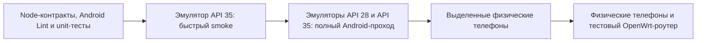

# Ручной стенд тестирования Android-приложений

<!-- §andlab1 -->

Этот документ описывает воспроизводимый стенд для родительского и детского APK
Sheepfold. Стенд запускается **только по явной команде**: при непосредственной
работе над Android-сценарием, перед передачей новых APK на проверку либо как часть
полного предрелизного прохода. Обычные `npm.cmd test`, `quality:changed` и CI не
скачивают system images и не запускают виртуальные телефоны.

## Зачем нужен гибридный стенд

Одного эмулятора недостаточно. Он хорошо воспроизводит Android API, lifecycle,
Compose UI, навигацию и ошибки сети, но не доказывает поведение камеры, SIM,
настоящего Wi-Fi, private MAC, OEM-ограничений фоновой работы и сопряжения через
реальный роутер. Поэтому стенд состоит из четырёх уровней:



| Уровень | Что ловит | Когда запускать | Чего не доказывает |
|---|---|---|---|
| Статические и unit-тесты | API-контракты, сериализацию, ресурсы, правила безопасности | при каждой профильной правке | Android runtime и геометрию экрана |
| `emulatorSmoke` API 35 | запуск APK, Compose semantics, первый экран | при прямой работе над Android UI/lifecycle | старую поддерживаемую версию и реальное железо |
| `emulatorFull` API 28/35 | нижнюю и верхнюю границы поддержки | перед выдачей APK и релизом | камеру, Wi-Fi, SIM и прошивки производителей |
| `physicalSmoke` | фактический Android runtime выбранного телефона | после правок камеры, разрешений, уведомлений, виджетов, биометрии | взаимодействие с роутером, если тот не участвует |
| Телефон + живой роутер | discovery, QR, TLS pin, токены, API и изменение таблиц LuCI | перед релизом и после изменения pairing/network contracts | поведение всех моделей телефонов и роутеров |

## Состав стенда

- Windows 10/11 с включённой аппаратной виртуализацией и Windows Hypervisor
  Platform (WHPX);
- JDK 17 и Android SDK из `tools/windows/setup.ps1`;
- Android Emulator и два отдельных AOSP x86_64 system image;
- AVD `SheepfoldLabApi28` для минимально поддерживаемого Android 9;
- AVD `SheepfoldLabApi35` для текущей целевой платформы;
- один или два выделенных физических Android-телефона без ценных данных;
- отдельный тестовый OpenWrt-роутер для сквозных pairing/Wi-Fi/API сценариев.

AVD запускаются последовательно, чтобы не занимать память двумя виртуальными
телефонами одновременно. Точный размер зависит от версии SDK, но перед первой
установкой разумно иметь не менее 12 ГБ свободного места. Google Play в базовые
AVD не входит: для Sheepfold важнее чистый AOSP runtime, а сценарии, зависящие от
Google Play Services, должны получить отдельный обоснованный профиль.

## Первичная настройка Windows

Сначала подготовить общий toolchain из корня репозитория:

```powershell
powershell -ExecutionPolicy Bypass -File tools\windows\setup.ps1 -Install -AcceptAndroidLicenses -AndroidSdkRoot "$env:LOCALAPPDATA\Android\Sdk"
```

Затем установить только проектные system images и AVD:

```powershell
npm.cmd run androidLab:setup -- -Install -AcceptAndroidLicenses
```

Команда скачивает официальные AOSP images API 28/35 и создаёт только два AVD с
именами Sheepfold. Она не удаляет существующие AVD. Явный `-RecreateAvds` может
пересоздать только `SheepfoldLabApi28` и `SheepfoldLabApi35`; посторонние AVD
скрипт не трогает. Сетевой сбой `sdkmanager` повторяется до пяти раз с паузой;
если все попытки исчерпаны, уже исправные SDK-компоненты не удаляются.

Проверка готовности без запуска эмулятора:

```powershell
npm.cmd run androidLab:doctor
```

Она проверяет SDK, JDK, WHPX и оба AVD. Для диагностики ускорения отдельно можно
выполнить:

```powershell
& "$env:LOCALAPPDATA\Android\Sdk\emulator\emulator.exe" -accel-check
```

## Профили запуска

Быстрый проход на API 35:

```powershell
npm.cmd run androidLab:smoke
```

Полный последовательный проход на API 28 и API 35:

```powershell
npm.cmd run androidLab:full
```

По умолчанию проверяются оба APK. Для одного приложения:

```powershell
npm.cmd run androidLab:smoke -- -AppScope parent
npm.cmd run androidLab:smoke -- -AppScope child
```

Для визуального наблюдения добавить `-ShowEmulator`. Для исследования состояния
после теста добавить `-KeepEmulator`; завершить такой AVD нужно вручную через
`adb -s emulator-5572 emu kill`. `-CollectBugreportOnFailure` создаёт большой
Android bugreport только при падении и потому не включён по умолчанию.

## Физический телефон

`physicalSmoke` удаляет данные тестируемого debug APK, чтобы действительно
проверить чистый первый запуск. Использовать его можно только на выделенном
тестовом телефоне после включения USB debugging:

```powershell
& "$env:LOCALAPPDATA\Android\Sdk\platform-tools\adb.exe" devices -l
npm.cmd run androidLab:physical -- -DeviceSerial PHONE_SERIAL -ConfirmResetTestApps
```

Runner проверяет точный serial, отклоняет эмулятор в этом профиле и требует
отдельный флаг подтверждения. Он удаляет только пакеты
`app.sheepfold.android`, `app.sheepfold.android.test`, `app.sheepfold.child` и
`app.sheepfold.child.test`. Factory reset, `adb root`, reboot телефона, смена
Wi-Fi и команды роутеру в него не входят.

Перед physical-проходом сохранить нужные пользователю данные и убедиться, что на
телефоне нет рабочей версии Sheepfold с незаменимым локальным состоянием.

## Реализованные instrumented-тесты

| Тест | Защищаемое поведение | Почему нужен Android runtime |
|---|---|---|
| `ParentFirstLaunchSmokeTest.cleanInstallRequiresAgreement` | чистая установка показывает пользовательское соглашение, а кнопка «Далее» заблокирована | проверяются реальные Compose semantics и состояние кнопки |
| `ChildFirstLaunchSmokeTest.cleanInstallStartsAutomaticDiscovery` | детский APK начинает с автопоиска Sheepfold, а не с обязательного ручного IP | проверяется фактический первый экран Activity |
| `SupportReportCryptoTest.hpkeCiphertextDecryptsWithOperatorPrivateKey` | production utility шифрует показанный plaintext публичным HPKE keyset, а расшифровать его можно парным operator private key только с тем же context info | проверяется реальная Tink Android implementation, которую статический Node-тест не исполняет |

Перед каждым тестом runner удаляет соответствующий debug APK и тестовый пакет,
затем ставит свежие `app-debug.apk` и `app-debug-androidTest.apk`. Это намеренная
изоляция чистого запуска, а не способ обновления пользовательского приложения.

## План расширения покрытия

Следующие сценарии добавляются небольшими независимыми наборами, когда меняется
соответствующая функция:

1. **Первичная настройка родителя:** возврат назад без автоматического прыжка
   вперёд, согласие, Android permissions, ручной адрес и восстановление шага.
2. **QR:** импорт тестового QR из файла в эмуляторе; квадрат preview, камера и
   повторное сканирование после ошибки на физическом телефоне.
3. **Сеанс роутера:** `token_invalid`, `token_expired`, `token_revoked`, timeout,
   5xx и смена TLS SPKI. Ошибки сети не должны стирать рабочий токен, а явный отзыв
   должен возвращать только к повторному сопряжению.
4. **Детский статус:** online/offline, время следующего изменения доступа,
   30-секундный автопоиск и понятный fallback ручного адреса.
5. **Фоновая работа:** WorkManager детского APK с управляемыми constraints,
   задержкой и ошибкой repository; отдельно AlarmManager предупреждения доступа.
6. **UI-матрица:** светлая/тёмная тема, увеличенный системный шрифт, поворот,
   малый экран API 28 и проверка, что кнопки и текст не сливаются с фоном.
7. **Физические функции:** уведомления, виджеты, биометрия, SIM/слоты, private
   MAC, BSSID/SSID, OEM battery restrictions и возобновление после перезагрузки.
8. **Редакторы родительского APK:** устройства, группы, расписания, Wi-Fi,
   журнал и уведомления через версионированный fake-router contract.

Fake router должен отвечать той же схеме, что OpenWrt, иметь фиксированный
тестовый TLS-ключ и уметь воспроизводить задержку, обрыв, malformed JSON и
версионные ответы. Не следует подменять им живой pairing: тестовый сервер на
Windows доступен стандартному эмулятору по специальному адресу `10.0.2.2`, но
это NAT виртуального роутера, а не домашняя LAN и не default gateway телефона.

## Сквозной проход с живым роутером

Эта часть пока остаётся ручной и выполняется совместно с
[`live-router-testing.ru.md`](live-router-testing.ru.md):

1. создать нового тестового администратора либо явно выбрать существующего;
2. открыть QR в LuCI и отсканировать физическим родительским телефоном;
3. проверить одноразовое сжигание кода, выдачу bearer token и TLS SPKI;
4. проверить появление телефона у того же администратора, корону, числовой ID и
   запись журнала;
5. изменить разрешённую настройку из APK и подтвердить UCI/runtime и обновление
   строки LuCI без перезагрузки всей страницы;
6. отозвать токен и проверить возврат APK только к повторному сопряжению;
7. заменить тестовый сертификат и подтвердить, что новый QR восстанавливает
   доверие, а молчаливого принятия нового SPKI нет;
8. повторить детский discovery/status с Wi-Fi тестового роутера.

Автоматизация этого этапа будет отдельным профилем с backup/restore и точным
адресом тестового роутера. Текущий Android runner **не подключается к роутеру и
не меняет его состояние**.

## Отчёты и приватность

Каждый прогон сохраняет instrumentation output и `logcat`, затем повторно
открывает точный debug-компонент Sheepfold и снимает его screenshot и UI dump в:

1. `SHEEPFOLD_SCRIPT_SCRATCH_ROOT\sheepfold-android-lab`, если переменная задана;
2. `Documents\pesochnica\sheepfold-android-lab` на рабочем компьютере владельца;
3. `.build\android-lab`, если внешний scratch недоступен.

Отчёты не коммитятся. Logcat и UI dump могут содержать IP, имена сетей, текст
уведомлений и другие технические идентификаторы. Перед передачей отчёта нужно
просмотреть и замаскировать такие поля, а после закрытия ошибки удалить ненужный
run-каталог. Полный bugreport собирается только явным флагом.

## Что эмулятор принципиально не подтверждает

- настоящий Wi-Fi association, BSSID, private/random MAC и переход 2,4/5 ГГц;
- номер и смену SIM, особенности нескольких слотов и ограничения оператора;
- качество камеры, геометрию scanner preview и QR с реального монитора;
- OEM-ограничения Xiaomi/ZTE/Tecno и других прошивок;
- биометрию, виджеты и уведомления в конкретном launcher;
- доступность Sheepfold через реальную топологию нескольких домашних роутеров;
- firewall, DHCP, UCI и факт появления устройства в LuCI.

Поэтому зелёный `androidLab:full` не разрешает пропустить физический телефон и
живой роутер для изменений pairing, Wi-Fi, SIM, TLS или фоновой работы.

## Официальные материалы Android

- [Instrumented tests](https://developer.android.com/training/testing/instrumented-tests)
- [AndroidJUnitRunner и Android Test](https://developer.android.com/training/testing/instrumented-tests/androidx-test-libraries/runner)
- [Compose UI testing](https://developer.android.com/develop/ui/compose/testing)
- [Android Emulator networking и `10.0.2.2`](https://developer.android.com/studio/run/emulator-networking-address)
- [Ускорение Android Emulator на Windows](https://developer.android.com/studio/run/emulator-acceleration)
- [Gradle Managed Devices](https://developer.android.com/studio/test/managed-devices)

Gradle Managed Devices остаются допустимым будущим CI-вариантом. Сейчас выбран
ручной runner: ему проще назначить точный serial, безопасно отделить физические
телефоны и не превратить тяжёлую загрузку system images в каждую обычную проверку.
