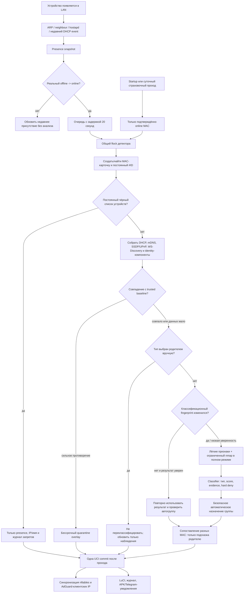

# Паспорт устройства, мониторинг и управление (§devpas1)

## Статус документа

Последняя полная сверка с текущим рабочим деревом: 19 июля 2026 года.

Это каноническое end-to-end описание той части Sheepfold, которая отвечает за:

- обнаружение домашнего устройства;
- выдачу пользовательского `#ID`;
- online/offline-наблюдение;
- сбор признаков с роутера;
- определение типа устройства;
- создание доверенного отпечатка;
- обнаружение возможной подмены;
- автоматическое и ручное назначение групп;
- применение правил доступа;
- журнал, уведомления и отображение в LuCI;
- границы доверия к Android-приложениям.

Если краткая формулировка в другом документе противоречит этому файлу, сначала надо сверить
реальный код и тесты, затем обновить оба документа. Исследование источников и альтернатив
находится в [device-detection-research.ru.md](device-detection-research.ru.md), подробности
классификатора — в [device-identification-design.ru.md](device-identification-design.ru.md),
а перечень скрытых параметров — в [hidden-settings.ru.md](hidden-settings.ru.md).

### Короткая модель за одну минуту

Для понимания всей системы достаточно сначала разделить семь сущностей:

1. **Карточка устройства** — строка в Sheepfold, привязанная к одному MAC и получившая удобный
   номер `#ID`. Это контейнер данных, но ещё не доказательство личности прибора.
2. **Присутствие** — ответ на вопрос «этот MAC действительно сейчас в домашней сети?». Оно
   запускает анализ, но само не даёт и не отнимает права.
3. **Наблюдения** — DHCP, mDNS, SSDP/UPnP, WS-Discovery, OUI и ограниченная проверка портов. Это сырьё для двух
   независимых механизмов ниже.
4. **Классификация** — предположение «это телефон», «это сервер», «это колонка». Она нужна для
   понятного интерфейса и безопасной автогруппы.
5. **Доверенный baseline** — сохранённое сочетание устойчивых признаков известной MAC-карточки.
   Он отвечает только на вопрос «похоже ли подключение на прежнее физическое устройство?».
6. **Решение родителя** — имя, тип, группа, белый или чёрный список устройств, расписание,
   временный доступ и админская привязка. Оно сильнее обычной автоматики.
7. **Защитный overlay** — карантин при заметном противоречии baseline. Он временно перекрывает
   права подозрительного подключения, не стирая решения родителя для настоящего устройства.

Затем firewall соединяет сохранённую политику родителя с защитным overlay и получает фактический
доступ. Журнал и уведомления объясняют родителю, почему состояние изменилось. Поэтому в Sheepfold
нет одного «магического отпечатка», который одновременно определяет тип, личность и права.

### Как читать этот документ

- Для общего понимания достаточно прочитать короткую модель, инварианты и общую схему.
- Для разбора неверно определённого устройства нужны разделы про presence, режимы анализа,
  classifier и автоматические группы.
- Для разбора возможной подмены нужны trusted baseline, карантин и похожий новый MAC.
- Для проверки конкретной настройки нужны матрица настроек и порядок политики доступа.
- Для изменения кода нужны хранилища, зависимости, карта файлов и финальный чеклист.

### Словарь

| Термин в коде и документации | Понятный смысл |
|---|---|
| `presence` | подтверждённое присутствие MAC в домашней LAN сейчас или в недавнем окне |
| `observation` / наблюдение | факт, полученный от DHCP, ARP, mDNS, SSDP, OUI или проверки портов |
| `evidence` / признак | нормализованное наблюдение, которому classifier назначил вес и семейство |
| `classifier` | модуль, предполагающий тип устройства и объясняющий уверенность |
| `classification fingerprint` | дешёвый контрольный hash входов classifier, чтобы не повторять тяжёлую работу без причины |
| `trusted identity baseline` | сохранённый эталон устойчивых HMAC-признаков известной MAC-карточки |
| `TOFU` | «доверие при первом достаточном наблюдении»: первый strong или multifactor набор становится baseline, но не выдаёт прав |
| `overlay` | дополнительное состояние поверх родительских прав, которое временно меняет итоговый доступ, не стирая исходную политику |
| `quarantine` / карантин | защитный overlay при достаточном противоречии trusted baseline |
| `provenance` / источник | отметка, кем создано значение: родителем, detector или другим backend-модулем |
| `hard_deny` | безусловный запрет classifier на привилегированное автоназначение в `Без ограничений` |

Слова `strong` и `trusted` здесь означают уровень домашней эвристики. Они не обещают
криптографическую аттестацию обычного телефона, телевизора или бытового прибора.

## Что Sheepfold называет паспортом

`Паспорт устройства` — это архитектурное понятие, а не один JSON-файл и не отдельная
UCI-секция нового типа. Паспорт складывается из нескольких слоёв:

| Слой | Примеры | Где хранится | Кто может менять |
|---|---|---|---|
| Карточка | MAC, `#ID`, первое обнаружение, последнее известное имя и IP | `/etc/config/sheepfold` | backend и родитель |
| Текущие наблюдения | online, источник присутствия, недавний IP | `/tmp/sheepfold/` | только backend |
| Классификация | тип, уверенность, аргументы, конкурирующие признаки, версия правил | `/etc/config/sheepfold` | detector или родитель |
| Доверенный baseline | HMAC-компоненты устойчивых идентификаторов | `/etc/config/sheepfold` | создаётся один раз; меняется только миграцией или явным доверием родителя |
| Родительская политика | группа, список устройств, расписания, временный доступ, админская привязка | `/etc/config/sheepfold` | родитель и защищённые backend-операции |
| Защитное состояние | карантин, причина и время уведомления | `/etc/config/sheepfold` | detector; снимается совпадением или родителем |
| Диагностическая связь | «новый MAC похож на устройство `#N`» | `/etc/config/sheepfold` | identity reconciler; прав не переносит |
| События | журнал и очередь уведомлений | RAM-журнал и `/etc/sheepfold/admin-notifications/` | backend |

Паспорт нужен не для тотальной слежки, а для трёх разных вопросов:

1. Что сейчас подключено к домашней сети?
2. На какой тип устройства это похоже и какие обычные настройки ему предложить?
3. Похоже ли текущее подключение на то физическое устройство, которому родитель раньше
   назначил права?

## Главные инварианты

Эти правила важнее отдельных эвристик:

1. **MAC является ключом карточки, но не доказательством физической личности.** Один MAC
   создаёт одну device-секцию. Новый MAC всегда получает отдельную карточку и отдельный `#ID`.
2. **`#ID` предназначен для человека и постоянен.** Он выдаётся из монотонного счётчика,
   не занимается повторно после удаления карточки и не используется как криптографический
   идентификатор. Пропуски в последовательности безопаснее изменения смысла старых журналов.
3. **IP, hostname и отображаемое имя не доказывают личность.** Они меняются и легко
   подделываются.
4. **Классификация и идентификация разделены.** «Это телевизор» и «это тот же самый телевизор»
   являются разными выводами.
5. **Автоматический вывод не равен родительскому решению.** Ручное имя, тип, группа и списки
   имеют приоритет.
6. **Новый MAC не наследует права старого**, даже если UUID совпал полностью.
7. **Постоянный чёрный список устройств выше автоматики.** Для такого устройства не запускаются
   классификация, identity-сопоставление, mDNS/SSDP-анализ и сканирование портов.
8. **Карантин является overlay.** Он временно перекрывает права текущего подключения, но не
   удаляет сохранённые права настоящего устройства.
9. **Тяжёлые проверки не работают постоянно.** Они запускаются событийно, ограничены по времени
   и кэшируются.
10. **Данные детского APK не являются основанием для firewall.** SIM, внешние Wi-Fi-сети и
    сообщения ребёнка могут создавать уведомления, но не подтверждают личность устройства.
11. **Админский Bearer-токен и сетевой отпечаток не заменяют друг друга.** Первый подтверждает
    право выполнять API-команды, второй защищает обычные сетевые права.
12. **Sheepfold не является полноценным NAC.** Новое устройство сначала появляется в LAN, а
    затем распознаётся роутером. До создания карточки возможна короткая задержка применения
    политики новых устройств.

## Общая схема



## Единицы идентификации

### UCI-секция устройства

Основной постоянный ключ текущей реализации — нормализованный MAC. Для нового MAC создаётся
секция вида:

```text
config device 'device_aabbccddeeff'
    option id '3'
    option mac 'AA:BB:CC:DD:EE:FF'
```

Это означает следующее:

- подмена MAC может привести трафик в карточку прежнего устройства;
- доверенный baseline нужен, чтобы заметить такую подмену, если устройство публикует устойчивые
  признаки;
- случайный новый MAC создаёт новую карточку, даже если это прежний телефон;
- Sheepfold может показать сходство двух карточек, но не объединяет их автоматически. Полное
  объединение возможно только после явного решения родителя (§merge01).

### Пользовательский `#ID`

`#ID` выдаёт `sheepfold-device-id`:

- используется следующий номер из монотонно растущего счётчика;
- существующий уникальный номер сохраняется навсегда;
- удалённая карточка не освобождает номер для нового устройства;
- обновление не уплотняет диапазон, поэтому пропуски являются нормой;
- старый формат вроде `D-0012` безопасно превращается в `12`, а прежняя запись остаётся в
  `legacy_ids` для совместимости токенов и журналов.

`#ID` является постоянной ссылкой для интерфейса, журнала и расписаний, но не доказывает
физическую личность устройства. Её по-прежнему оценивает MAC-карточка с доверенным baseline.

### Имя и IP

- IP является текущим или последним известным адресом и может измениться после новой аренды.
- Имя может прийти из DHCP, постоянной аренды или от родителя.
- Значения `arp`, `dhcp` и `static` никогда не показываются как имя устройства.
- Ручное имя имеет `name_source=user` и не заменяется автоматикой.
- Постоянная DHCP-аренда отображается вместе с карточкой, но сама по себе не означает, что
  устройство online.

## Откуда берутся наблюдения

| Источник | Что даёт | Надёжность для online | Надёжность для типа | Надёжность для личности | Нагрузка |
|---|---|---:|---:|---:|---:|
| `ip neigh` | MAC, IP, состояние соседа | высокая | нет | нет | очень низкая |
| `/proc/net/arp` | MAC и IPv4 | высокая при complete-записи | нет | нет | очень низкая |
| `hostapd.* get_clients` | факт association, HT/VHT/HE и текущий класс скорости | высокая | слабая подсказка | нет | низкая: один снимок на проход |
| недавний DHCP hotplug | MAC, IP и факт события | высокая в течение 120 секунд | средняя | отдельные поля могут быть слабыми identity-сигналами | низкая |
| `/tmp/dhcp.leases` | аренда, IP, hostname | недостаточна сама по себе | слабая | нет | очень низкая |
| постоянная DHCP-аренда | родительское имя и IP | не подтверждает online | полезный родительский контекст | нет | очень низкая |
| DHCP 55/60, user class, MUD URL | профиль сетевого стека и производителя | нет | средняя | не используется как доказательство личности | низкая |
| DHCP client-id | идентификатор DHCP-клиента | нет | слабая | слабая, если не равен MAC/`01+MAC` | низкая |
| OUI | производитель сетевого адаптера | нет | слабая/средняя | нет | низкая |
| mDNS/DNS-SD | сервисы, host, model, отдельные TXT ID | нет | средняя/высокая | host слабый; serial/device-id сильный эвристический | низкая |
| SSDP | тип сервиса, USN UUID, SERVER | нет | средняя/высокая | UUID сильный эвристический | низкая, активный запрос не чаще часа |
| UPnP description | производитель, модель, serial, UDN | нет | средняя/высокая | serial/UDN сильные эвристические | низкая, до 4 ответов за проход и не чаще суток на один URL |
| WS-Discovery | endpoint UUID, типы и scopes | нет | средняя для Windows, принтеров, камер/NVR | UUID сильный эвристический | низкая, пассивное окно; один Probe только для нового устройства |
| ограниченный `nmap` | открытые сервисные порты | нет | подтверждающая | нет | самая высокая из текущих проверок |

Все сетевые идентификаторы, включая UUID и serial, сообщаются самим устройством. Слово
`сильный` означает «достаточно устойчивый для домашней эвристики», а не криптографически
подписанное удостоверение.

### Чего нельзя узнать из обычного трафика

Паспорт устройства не содержит Google- или Яндекс-аккаунт пользователя. При обычном HTTPS/TLS
и QUIC роутер может увидеть IP, объём и время соединений, а иногда домен сервиса, но не адрес
электронной почты, логин или содержимое аккаунта. Домен `google.com` доказывает только обращение
к сервису Google, а не то, какой аккаунт использован. Sheepfold не должен подменять сертификаты,
расшифровывать TLS, угадывать аккаунт по косвенным признакам или называть такую догадку фактом.
Если когда-нибудь понадобится явная привязка аккаунта, она возможна только отдельным OAuth-потоком
с понятным согласием пользователя и не становится identity-признаком LAN-устройства.

## Online/offline и событийный запуск

### Мгновенный snapshot для событий

`sheepfold-device-presence current` объединяет только актуальные источники:

- рабочие LAN neighbour-записи;
- complete ARP-записи;
- association в hostapd;
- DHCP-событие не старше 120 секунд.

WAN-интерфейсы исключаются. Статическая аренда и старая строка `/tmp/dhcp.leases` не создают
online-событие.

### Два разных времени online

В коде намеренно существуют две оценки:

1. **Событийное online-состояние** опрашивается обычно каждые 10 секунд. Исчезнувший MAC
   удерживается 90 секунд, чтобы сон Wi-Fi, roaming 2,4/5 ГГц и краткая потеря ARP не создавали
   повторное подключение.
2. **Пользовательское «недавно был online»** хранится в RAM и имеет окно 15 минут. Поэтому LuCI
   может ещё показывать устройство недавно активным, хотя detector уже признал его offline.

Первая оценка управляет запуском анализа. Вторая нужна для спокойного интерфейса и времени
последнего появления.

### Когда запускается анализ

- через 20 секунд после настоящего offline→online;
- один раз после запуска Sheepfold, также с задержкой;
- один страховочный проход раз в сутки;
- вручную по кнопке родителя для выбранного online-устройства.

Во всех случаях анализируются только MAC, подтверждённые online в момент запуска. Очередь
обрабатывает максимум четыре события за один тик; остальные откладываются на пять секунд.
Неудачный занятый запуск повторяется через минуту. Все входы используют один `flock`, поэтому
ручной и фоновый анализ не меняют одну UCI-секцию одновременно.

## Лёгкий, полный и урезанный анализ

### Лёгкая часть

Всегда доступная часть использует DHCP, neighbour/ARP, hostapd, статическую аренду, локальную
OUI-базу при её наличии и кэшированные mDNS-данные. Один отдельный короткий снимок
`hostapd.* get_clients` на весь detector-проход также даёт HT/VHT/HE и текущие RX/TX rate. Он
не выполняется отдельно для каждого устройства и не работает как постоянный опрос. Эти сведения
нормализуются до коротких классов поколения и скорости и используются только как слабая
подсказка типа. Они никогда не являются identity-доказательством, отдельным evidence-семейством
или основанием для `Без ограничений`. Лёгкая часть не перебирает всю сеть и не сохраняет пакеты.

Сырые текущие rate живут только в `/tmp/sheepfold/device-wifi-capabilities.tsv`. В UCI остаются
лишь наилучшие уже наблюдавшиеся классы поколения и скорости. Такой монотонный профиль не
дёргается при roaming между 2,4 и 5 ГГц и не пишет flash из-за обычных колебаний радиоканала.

Если DHCP hotplug конкретной прошивки не дал расширенные поля, detector восстанавливает в RAM
только hostname и client ID из `/tmp/dhcp.leases`. Пустой hostname передаётся между стадиями
явным placeholder: BusyBox `read` иначе схлопывает два соседних tab и может потерять поле
источника присутствия. Локальный OUI-справочник Sheepfold лишь дополняет старую базу Nmap.
Для случайного local-admin MAC производитель всегда неизвестен; сочетание Wi-Fi association и
стандартного `01+MAC` client ID допускает только слабое предположение о личном телефоне.

### Полный режим

`detection_mode=full` дополнительно разрешает:

- активный LAN-only SSDP M-SEARCH, по умолчанию не чаще раза в час;
- короткое WS-Discovery-окно с пассивными `Hello`/`ProbeMatches`; один bounded Probe только при событии нового устройства;
- чтение не более четырёх UPnP descriptions за проход только для новых, неуверенных или
  ожидающих безопасную автогруппу устройств;
- `nmap`, если он установлен, по ограниченному списку портов;
- не более 16 просканированных хостов за проход;
- `-T2`, один retry и timeout одного хоста по умолчанию 20 секунд;
- повторный port scan одного устройства не чаще раза в сутки.

UPnP `LOCATION` считается полностью недоверенным. Допускается только `http://` к тому же
каноническому числовому IPv4 без ведущих нулей, с которого пришёл SSDP-ответ и который прямо
сейчас является LAN-neighbour. DNS, userinfo, redirect, обращение к IP самого роутера и ответы
больше 64 КБ запрещены; таймаут запроса равен трём секундам. Имя LAN-интерфейса извлекается из
ответа `ubus` штатным структурным парсером OpenWrt `jshn`, без скрытой зависимости от
`jsonfilter`. Управляющие URL из XML не вызываются. Сырой serial/UDN остаётся в RAM, а в UCI
попадают читаемая модель без идентификатора и HMAC identity-компоненты.

Даже после этих проверок UPnP остаётся самоописанием недоверенного клиента. Оно может улучшить
предположение о типе и стать одним из нескольких identity-сигналов, но само по себе не выдаёт
админские права, белый список устройств или группу `Без ограничений`.

WS-Discovery также привязан к LAN, ограничен десятью короткими poll-циклами и 96 сообщениями.
Обычный проход только слушает multicast, а один Probe с новым `MessageID` разрешён лишь при событии
нового устройства. Поле `XAddrs` читается только во временный RAM-снимок и никогда не открывается.

### Урезанный режим

`detection_mode=reduced` сохраняет DHCP, OUI и mDNS, но не запускает `nmap`, активный SSDP,
WS-Discovery и чтение UPnP descriptions.
Автогруппы остаются разрешёнными, однако набрать два независимых признака инфраструктуры
становится сложнее.

### Отключённая автонастройка

Пункт LuCI `Автонастройка новых устройств = Выключена` устанавливает `auto_configure=0`.
Он запрещает автоматическое изменение групп, но не отключает наблюдение, классификацию и
защитный identity-контроль. Это важно: «не настраивать за родителя» не означает «перестать
замечать возможную подмену».

Полное выключение detector существует как служебное `detection_mode=disabled`, но обычный
интерфейс его не предлагает.

## Определение типа

### Результат classifier

Classifier возвращает одновременно:

- `detected_type`;
- `detection_confidence` от 0 до 100;
- понятную причину;
- целевую автогруппу;
- отдельный score автодоверия;
- перечень независимых семейств evidence;
- число семейств;
- `hard_deny`, запрещающий привилегированную автогруппу;
- версию политики;
- производителя OUI;
- противоречащие признаки.

`device_type` и `detected_type` не являются двумя равноправными ответами. Первый становится
источником истины только при `manual_device_type=1`; иначе LuCI показывает `detected_type`,
оставляя `device_type` лишь совместимым со старыми конфигами резервным значением. В частности,
унаследованное `device_type=unknown` не перекрывает новый уверенный результат classifier.

Типы личных экранов и инфраструктуры разделены. Сетевое оборудование, телефоны, ПК,
телевизоры, медиаплееры, часы и консоли имеют `hard_deny` для группы `Без ограничений`.
Серверы, камеры, принтеры, домашние хабы и некоторые бытовые устройства могут быть кандидатами,
но только при дополнительных условиях. Умные колонки распознаются как отдельный тип, однако
автоматически не получают `Без ограничений`.

### Семейства доказательств

Для score одно семейство учитывается один раз:

- имя, сообщённое клиентом;
- имя постоянной аренды, заданное владельцем;
- DHCP-профиль;
- mDNS;
- UPnP/SSDP;
- WS-Discovery;
- OUI;
- открытые порты.

Два сообщения из одного mDNS-источника не становятся двумя независимыми доказательствами.
Если сильный признак указывает на другой тип, он записывается как competing evidence и снижает
уверенность и auto-score, но не более чем на 27 пунктов.

### Порог отображения

По умолчанию тип считается достаточно уверенным при 70%. Ниже этого порога интерфейс должен
показывать неизвестный тип, хотя техническая гипотеза и причина остаются в диагностике.
Низкая уверенность получает новую попытку при следующем подключении или суточном проходе, но
не чаще раза в сутки.

### Классификационный fingerprint

Fingerprint отвечает только на вопрос: «Изменились ли входы classifier?» Он включает:

- версию политики classifier;
- MAC;
- наблюдаемое и статическое имя;
- DHCP-профиль;
- кэш портов;
- mDNS/SSDP/UPnP/WS-Discovery-профили;
- текущие HMAC identity-компоненты;
- нормализованный монотонный Wi-Fi-профиль `generation + speed class`, но не BSSID и не rate.

Для него используется дешёвый state hash: SHA-256, а при его отсутствии допустим MD5.
Fingerprint не выдаёт права и никогда не подтверждает физическую личность. Его совпадение
позволяет не повторять дорогую классификацию.

### Почему отпечатков именно два

| Свойство | Классификационный fingerprint | Доверенный identity baseline |
|---|---|---|
| Вопрос | «Изменились ли входные данные определения типа?» | «Похоже ли это на прежний физический прибор в этой MAC-карточке?» |
| Состав | имя, DHCP-профиль, порты, mDNS/SSDP/UPnP/WS-Discovery-профиль, версия classifier и identity-компоненты | только устойчивые разрешённые UUID/serial/client-id/host семейства |
| Допустимая изменчивость | высокая: смена имени или сервисов должна запустить пересчёт типа | низкая: временное отсутствие признака не переписывает baseline |
| Защита хранения | дешёвый SHA-256 с допустимым MD5 fallback | только versioned HMAC-SHA-256 с локальным секретом |
| Реакция на изменение | повторить classifier; прямых санкций нет | при достаточном противоречии включить quarantine overlay |
| Кто может сбросить | detector при новой версии правил или родитель через повторное определение | положительное возвращение прежнего прибора либо явное доверие родителя |

Объединять их опасно. Если считать смену hostname или открытого порта подменой личности,
обычное обновление устройства будет ошибочно блокировать интернет. Если, наоборот, использовать
дешёвый кэш типа как доверенную личность, подмена MAC сможет сохранить старые права. Разделение
даёт одновременно низкую нагрузку и более осторожную защиту.

### История изменений классификационных признаков

В device-секции хранятся не более трёх последних `detection_snapshot_1..3`. Новый снимок
появляется только при изменении `detection_fingerprint`, поэтому обычный контрольный проход не
пишет flash. В снимке есть дата, первые 16 символов hash, тип, confidence, названия семейств
evidence и противоречащие семейства. В нём нет MAC, IP, hostname, UUID, serial и исходных
mDNS/SSDP/WS-Discovery значений. Добавление того же fingerprint с новой датой отдельно
отбрасывается, поэтому история не вращается из-за повторного вызова helper.

Эта история нужна для объяснения изменений вида «после обновления прибора исчезло семейство
mDNS» и не является третьим механизмом идентификации. Старейший четвёртый снимок удаляется.

## Доверенный отпечаток личности

### Какие компоненты используются

Текущая реализация знает семь семейств. `device_uuid` объединяет одинаковый endpoint UUID,
полученный по UPnP и WS-Discovery, не превращая протокол в отдельное доказательство:

| Семейство | Уровень | Примечание |
|---|---|---|
| `device_uuid` | сильное эвристическое | протокол-независимый HMAC одного UUID из UPnP/WS-Discovery |
| `upnp_uuid` | сильное эвристическое | UUID извлекается из SSDP USN |
| `upnp_serial` | сильное эвристическое | serialNumber из ограниченно прочитанного UPnP XML |
| `wsd_uuid` | сильное эвристическое | endpoint UUID из WS-Discovery |
| `mdns_serial` | сильное эвристическое | serial, UUID или device-id из разрешённых mDNS TXT |
| `dhcp_client` | слабое | client-id, если он не дублирует MAC |
| `mdns_host` | слабое | устойчивое `.local`-имя |

Baseline создаётся по TOFU-модели при первом наблюдении:

- достаточно одного сильного семейства; или
- нужны не менее двух независимых слабых семейств;
- один слабый признак оставляет статус `только MAC`;
- создание baseline само по себе не выдаёт никаких прав.

### Почему HMAC, а не обычный hash

Исходные UUID и serial нормализуются в RAM, затем сохраняются только как
`family:HMAC-SHA-256`. Используется отдельный случайный секрет роутера:

```text
/etc/sheepfold/.device-identity-hmac
```

Секрет имеет права `0600`, сохраняется при package update и `sysupgrade`, не входит в обычный
экспорт настроек. HMAC:

- не позволяет сравнивать одинаковые serial между украденными конфигами разных роутеров;
- не раскрывает исходное значение без локального секрета;
- не делает ложное объявление устройства подлинным;
- не заменяет trusted baseline, а является способом безопасно хранить его компоненты.

Удаление или потеря этого секрета приведёт к несовпадению прежних HMAC. Файл нельзя очищать как
обычный кэш. При переносе UCI-конфига на другой роутер identity baseline требует отдельной
миграции или повторного подтверждения.

### Сравнение baseline

```mermaid
stateDiagram-v2
    [*] --> MacOnly: "Недостаточно устойчивых компонентов"
    [*] --> Trusted: "1 сильное или 2 слабых семейства"
    MacOnly --> Trusted: "Позже появились достаточные признаки"
    Trusted --> Trusted: "Сильное совпадение или 2 слабых совпадения"
    Trusted --> Trusted: "Данных временно мало; baseline не переписывается"
    Trusted --> Quarantine: "Сильное противоречие или 2 слабых противоречия"
    Quarantine --> Trusted: "Положительно вернулось прежнее устройство"
    Quarantine --> Trusted: "Родитель нажал «Доверять текущему подключению»"
    Quarantine --> Quarantine: "Данных мало или вопрос не решён"
```



Приоритет сравнения:

1. Противоречащий strong UUID/serial сильнее совпавшего слабого hostname.
2. Совпавший strong идентификатор подтверждает подключение.
3. Два совпавших слабых семейства подтверждают подключение.
4. Два противоречащих слабых семейства создают подозрение.
5. Исчезновение mDNS/SSDP или один слабый mismatch не создают новый карантин.
6. Уже включённый карантин не снимается просто из-за исчезновения доказательств.

Старые baseline без HMAC мигрируют только после положительного сравнения прежним алгоритмом.
Это предотвращает массовый карантин сразу после обновления пакета.

## Карантин

Карантин появляется только у **известной MAC-карточки**, если текущее подключение заметно
противоречит её baseline.

| Настройка `Мониторинг и настройка устройств` | Overlay | Интернет | Доступ к LuCI/SSH/API | Сохранённые права |
|---|---|---|---|---|
| `Автоматически` | `identity_quarantine_mode=block` | закрыт, кроме настроенных аварийно-полезных сайтов | закрыт, кроме необходимых DNS/DHCP | не меняются |
| `Вручную` | `identity_quarantine_mode=restrict` | ограничен, аварийно-полезные сайты доступны | закрыт, кроме необходимых DNS/DHCP | не меняются |

`block` здесь не добавляет MAC в постоянный чёрный список устройств. Это отдельное защитное
состояние той же карточки.

Режим `Автоматически/Вручную` влияет только на интернет-политику. При любом нерешённом
несовпадении отпечатка управление роутером через LuCI, SSH и Sheepfold API закрыто.

Карантин:

- не имеет таймера автоматического снятия;
- повторяет уведомление не чаще раза в сутки;
- приостанавливает админские, `Без ограничений` и allowlist-привилегии текущего подключения;
- автоматически снимается при сильном/многофакторном возвращении прежнего fingerprint;
- может быть снят родителем кнопкой `Доверять текущему подключению`.

Ручная кнопка при карантине делает сразу три действия: принимает текущие HMAC-компоненты как
новый baseline, снимает overlay и запускает полное повторное определение типа. Поэтому её нельзя
нажимать только ради обновления типа, если родитель не узнал устройство.

### Как не перепутать значки в LuCI

| Элемент интерфейса | Что он означает | Чего он не означает |
|---|---|---|
| Значок типа: телефон, сервер, колонка и так далее | результат classifier или ручной выбор родителя | подтверждение физической личности и право на интернет |
| Зелёный значок человека с шестерёнкой | есть strong или multifactor trusted baseline | устройство невозможно подделать или оно администраторское |
| Красный перечёркнутый значок человека с шестерёнкой | карточка пока защищена в основном MAC; надёжно заметить подмену нельзя | устройство вредоносное или уже заблокировано |
| Плашка `Online` | устройство замечено в недавнем окне presence | новый полный анализ выполняется прямо сейчас |
| Плашка статуса доступа | результат списков, карантина, расписаний и другой политики | тип или надёжность распознавания |
| Жёлтая корона | устройство назначено администратору | trusted baseline обязательно существует |
| Замок рядом с IP | существует постоянная DHCP-аренда | устройство сейчас online или его IP нельзя подделать |
| Плашка журнала в AI Support | для устройства включён сбор активности | эти данные входят в trusted baseline или доступны другим членам семьи |

Если одновременно показаны, например, корона и красный перечёркнутый identity-значок, это не
визуальное противоречие: родитель назначил административное право, но роутер пока умеет отличать
этот прибор от подмены только по MAC. При реальном identity mismatch карантин всё равно проверяется
раньше администраторской привилегии.

## Похожее устройство с другим MAC

После текущего прохода `sheepfold-device-identity` сравнивает сохранённые HMAC-компоненты всех
не заблокированных карточек. Поэтому новая online-карточка может быть сопоставлена и с историей
устройства, которое сейчас offline:

- точный strong UUID/serial или два совпавших слабых семейства создают связь-кандидат;
- корневой подсказкой выбирается минимальный `#ID` компоненты;
- новая карточка получает `logical_device_suggestion_id` и причину;
- права, группы, списки, расписания, админский статус и временный доступ не копируются;
- постоянный чёрный список устройств вообще не участвует в таком сопоставлении.

Это диагностическая подсказка вида «подключение похоже на устройство `#2`», а не объединение.
Отдельная подтверждённая модель одного физического устройства с несколькими интерфейсами пока
не завершена.

### Планируемое полное объединение записей (§merge01)

Кнопка `Объединить с другой записью` должна находиться в модальном окне настройки конкретного
устройства, внутри раскрываемого блока `Идентификация устройства`. Так родитель сначала видит,
какую карточку он редактирует, и не пытается соединять строки таблицы перетаскиванием.

После нажатия открывается отдельное окно с фильтром и кандидатами. Для каждого кандидата нужны
`#ID`, имя, MAC/интерфейс, текущий или последний IP, online-статус, группа/статус доступа и
понятная причина сходства, если она есть. Родитель выбирает вторую запись, видит сравнение и
ещё раз подтверждает необратимое объединение.

Объединение является **полным**, а не набором независимых флажков:

- основной карточкой по умолчанию становится более старая запись с меньшим постоянным `#ID`;
- все MAC и сетевые интерфейсы становятся подключениями одного логического устройства;
- объединяются история, наблюдения, evidence и пользовательские заметки;
- одна итоговая группа, расписания, временный доступ и принадлежность к белому/чёрному списку
  устройств применяются ко всем интерфейсам;
- до подтверждения UI показывает противоречащие политики двух записей и сообщает, какое
  итоговое значение сохранится;
- второй `#ID` остаётся постоянным alias/tombstone для старых журналов и никогда не выдаётся
  новому устройству;
- firewall и presence после объединения учитывают все связанные MAC;
- разъединение, если оно будет добавлено, является отдельной явной операцией с собственным
  выбором политик, а не скрытым откатом.

Сходство UUID, serial, имени или портов никогда не нажимает эту кнопку автоматически. Для
админского устройства сетевое объединение не копирует секреты сопряжения: существующие Bearer-
токены нужно отозвать, а приложение привязать заново через QR. Это небольшое неудобство не даёт
ошибочно объединённой карточке унаследовать действующий административный ключ.

### Один UUID одновременно у двух online-MAC

Одинаковый самообъявленный UUID у двух подключений может означать Ethernet и Wi-Fi одного
прибора, ошибку прошивки производителя или подмену. Поэтому Sheepfold действует строго:

1. Сравниваются только карточки, которые подтверждённо online в текущем presence snapshot.
2. Прежней считается карточка с меньшим числовым `#ID`; её права и состояние не меняются.
3. Более новая карточка получает бессрочный quarantine overlay и ссылку на прежний `#ID`.
4. Ни группа, ни белый/чёрный список устройств, ни админские права не копируются.
5. Явное решение родителя запоминается для этой пары, чтобы не повторять тот же вопрос.

Это не утверждение, что новое подключение злонамеренно. Карантин сохраняет осторожность до тех
пор, пока родитель не различит два интерфейса одного прибора, сброс прошивки и реальную подмену.

## Автоматическое назначение групп

### Общий предохранитель

Автогруппа назначается только при `auto_configure=1`. Детектор не меняет группу, если:

- устройство в постоянном чёрном или белом списке устройств;
- это админское устройство;
- родитель уже выбрал любую другую группу;
- устройство раньше вручную убрали из соответствующей автогруппы;
- тип или evidence не достигли порога.

### `Персональные устройства`

Телефон, планшет, компьютер, телевизор/медиаплеер и умные часы могут попасть в защищённую от
удаления организационную группу при уверенности не ниже 70%. Эта группа **не даёт** обхода
глобальной блокировки, расписаний или списков.

### `Без ограничений`

Автоматическое назначение инфраструктуры требует одновременно:

- тип входит в разрешённый инфраструктурный набор;
- отсутствует `hard_deny`;
- auto-score не ниже 80%;
- есть не менее двух независимых семейств evidence;
- устройство не было вручную исключено из повторного автоназначения.

Умные колонки не входят в этот набор: они остаются обычными управляемыми устройствами и могут
попасть в `Персональные устройства`, но не получают автоматический обход ограничений.

Повтор одного UUID во втором подключении не считается вторым доказательством. Автоматическое
назначение записывается с `group_source=detector`, причиной и временем и создаёт уведомление.

Если ранее автоматически доверенная инфраструктура затем уверенно определяется как персональное
устройство, Sheepfold может снять **только собственное** назначение `Без ограничений` и назначить
обычную группу `Персональные устройства`. Ручное назначение родителя не снимается никогда.

Если родитель вручную убрал устройство из `Без ограничений` или `Персональные устройства`,
ставится соответствующий `*_auto_excluded=1`; следующий проход не возвращает его обратно.

## Ручные решения и происхождение полей

| Действие родителя | Что происходит после сохранения |
|---|---|
| Изменить имя | `name_source=user`; автоматическое имя больше его не заменяет |
| Выбрать тип | `manual_device_type=1`, `device_type_source=user`; classifier типа больше не запускается |
| Выбрать `Неизвестный тип` | ручная фиксация снимается; detector снова может определять тип |
| Выбрать группу | `group_source=user`; автогруппа её не заменяет |
| Убрать из автогруппы | дополнительно запрещается повторное автоматическое возвращение |
| Добавить в белый/чёрный список устройств | противоположный список не очищается автоматически; конфликт отклоняется |
| Настроить постоянную аренду | обновляется существующая `dhcp host`-секция, без создания дубля |
| `Определить заново` | только для online и не blocklist; очищается ручной тип и кэш классификации, затем выполняется полный проход |
| `Доверять текущему подключению` | текущий identity становится baseline, карантин снимается, затем тип определяется заново |

Настройки на вкладках Sheepfold сначала попадают в общий draft и применяются кнопкой
`Сохранить настройки`. Модальные редакторы устройства имеют собственную явную кнопку сохранения;
после успешного UCI commit frontend обновляет строки без перезагрузки всей страницы.

## Настройки и их точный смысл

| Настройка LuCI | UCI | По умолчанию | Что меняет | Чего не меняет |
|---|---|---|---|---|
| Поведение для новых устройств | `new_device_policy` | `allow` | доступ карточек со статусом new/unknown | способ определения типа |
| Автонастройка новых устройств | `auto_configure` + `detection_mode` | полный режим | разрешение автогрупп и стоимость анализа | identity-мониторинг |
| Мониторинг и настройка устройств | `device_monitoring_mode` | `automatic` | block или restrict при mismatch | постоянные списки и baseline |
| Автодобавление в `Без ограничений` | `no_restrictions_auto_assign` | `1` | разрешает привилегированную автогруппу | пороги evidence |
| Автодобавление в `Персональные устройства` | `personal_devices_auto_assign` | `1` | разрешает обычную автогруппу | права доступа |

Скрытые ограничители:

| UCI | Значение | Назначение |
|---|---:|---|
| `detector_watch_interval_seconds` | 10 | частота проверки событий |
| `detector_interval_seconds` | 86400 | суточный страховочный проход |
| `detector_connection_delay_seconds` | 20 | ожидание дополнительных признаков после подключения |
| `detector_offline_grace_seconds` | 90 | подавление online/offline flapping |
| `detector_max_event_scans_per_tick` | 4 | событий за тик |
| `detector_max_hosts_per_scan` | 16 | nmap-хостов за проход |
| `detector_min_device_type_confidence` | 70 | порог уверенного типа и personal group |
| `detector_min_no_restrictions_confidence` | 80 | порог инфраструктурной автогруппы |
| `detector_nmap_host_timeout_seconds` | 20 | timeout одного хоста, clamp 2–60 |
| `detector_full_rescan_seconds` | 86400 | срок кэша port scan |
| `detector_low_confidence_retry_seconds` | 86400 | минимальная пауза повторной слабой классификации |
| `detector_ssdp_rescan_seconds` | 3600 | срок SSDP-кэша, clamp 900–86400 |
| `identity_quarantine_reminder_seconds` | 86400 | минимум между напоминаниями; меньше суток не принимается |

## Как паспорт влияет на доступ

Detector сам не пишет произвольные nftables-правила. Он сохраняет тип, группу и quarantine
overlay, после чего `sheepfold-firewall sync` пересобирает только принадлежащие Sheepfold sets.

Фиксированный порядок политики устройства:

```text
identity quarantine / постоянный чёрный список устройств
→ админское устройство
→ группа «Без ограничений»
→ белый список устройств
→ глобальное отключение интернета
→ временное разрешение
→ расписание устройства
→ расписание группы
→ обычный доступ / политика нового устройства
```

Аварийно-полезные сайты являются отдельным узким исключением перед интернет-drop. Они не
открывают LuCI, SSH или Sheepfold API устройству из постоянного blocklist либо block-quarantine.

Белый и чёрный **списки сайтов** не являются частью физического паспорта. Они применяются после
решения Sheepfold по устройству через встроенный доменный backend или AdGuard Home. Podkop
получает только уже разрешённый трафик и не участвует в определении устройства.

Обычному домашнему устройству не требуется по умолчанию запрещать сам адрес роутера. Доступ к
странице входа LuCI ещё не даёт права изменять настройки: это защищают root-пароль, сессия LuCI,
Bearer-токен API и ограничение попыток. Сплошной запрет для всех неадминских устройств может
запереть родителя с нового телефона и сломать локальные страницы диагностики. На сетевом уровне
LuCI, SSH и Sheepfold API всегда закрываются для постоянного чёрного списка устройств и для
нерешённого identity-карантина; неуспешные попытки входа остальных устройств журналируются.

## Журнал и уведомления

### События passport lifecycle

Сейчас создаются как минимум следующие события:

- обнаружено новое устройство с `#ID`, MAC, IP и именем при наличии; положительные внутренние
  баллы не перечисляются, но противоречащие источники добавляются в уведомление;
- устройство автоматически добавлено в группу;
- собственное автоматическое `Без ограничений` снято после изменения типа;
- identity mismatch и включение карантина;
- суточное напоминание о нерешённом карантине;
- прежний доверенный fingerprint вернулся и карантин снят;
- UCI commit или сохранение автогруппы завершились ошибкой.

Журнал по умолчанию находится в RAM и переживает только текущую загрузку роутера. Очередь
администраторских уведомлений является отдельным механизмом:

- каталог `/etc/sheepfold/admin-notifications/`;
- максимум 100 событий;
- максимум 30 дней;
- чтение одним телефоном не удаляет событие для второго администратора;
- paired parent APK получает очередь через защищённый `/notifications`;
- при настроенном Telegram выполняется дополнительная немедленная отправка.

Уведомление создаётся для нового устройства, identity mismatch и автоматического назначения
`Без ограничений`. Обычное повторное узнавание пишется только в журнал. Подсказка о похожем
новом MAC сейчас показывается в LuCI, но отдельного push-уведомления не создаёт.

Если включён LED-режим нового устройства, detector создаёт RAM-флаг. Открытие Sheepfold в LuCI
подтверждает просмотр и возвращает LED к штатному режиму. Подтверждение LED после просмотра
уведомления в родительском APK пока не реализовано полностью и не должно описываться как готовое.

## Android и границы доверия

### Родительский APK

Одноразовый QR-код нужен для сопряжения. После успешного обмена приложение получает Bearer-токен,
привязанный к администратору и router-side устройству. Этот токен подтверждает API-команды, но не
заменяет trusted network baseline обычного трафика.

### Детский APK

Детское приложение не является обязательным агентом контроля. Sheepfold предполагает, что у
ребёнка может быть другой телефон или изменённое приложение. Поэтому следующие сведения только
информационные:

| Данные APK | Для чего используются | Для чего не используются |
|---|---|---|
| смена SIM | журнал и уведомление | определение физической личности, firewall, группы |
| новая внешняя Wi-Fi-сеть | opt-in история и уведомление | доказательство местоположения точки, права доступа |
| запрос `+30 минут` | запрос выбранному администратору | автоматическая выдача доступа |
| текст ИИ-чата | разговор в AI-варианте | сетевой паспорт и автоматические санкции |

Router backend сопоставляет отчёт с текущим IP/MAC LAN, но это подтверждает только источник
соединения в данный момент. SIM fingerprint, SSID и координаты не добавляются в trusted baseline.

## Где что хранится

### Постоянно

```text
/etc/config/sheepfold
/etc/sheepfold/.device-identity-hmac
/etc/sheepfold/admin-notifications/*.notification
```

Основные поля device-секции:

```text
id, legacy_ids, mac, first_seen_at, name, name_source, ip
status, group, group_source, device_type, device_type_source, manual_device_type
admin_device, admin_owner
detected_type, detection_confidence, detection_reason
detection_target_group, detection_auto_group_score
detection_evidence, detection_evidence_count, detection_competing_evidence
detection_hard_deny, detection_policy_version, detection_fingerprint
detection_snapshot_1, detection_snapshot_2, detection_snapshot_3
detection_ports, detection_ports_scanned_at
detection_oui_vendor, detection_mdns_services, detection_mdns_profile
detection_ssdp_profile, detection_wsd_profile, detection_last_analysis_at, detection_updated_at
detection_identity_keys, detection_identity_version
trusted_identity_keys, trusted_identity_version
identity_quarantine_mode, identity_quarantine_reason, identity_quarantine_at
identity_quarantine_keys, identity_quarantine_keys_version
identity_quarantine_notified_at
logical_device_suggestion_id, logical_device_suggestion_reason
logical_device_suggestion_at
identity_uuid_collision_with_id, identity_uuid_collision_reason
identity_uuid_collision_accepted_with_id
auto_group_assigned, auto_group_reason, detection_auto_group_status
no_restrictions_auto_excluded, personal_devices_auto_excluded
```

### Только в RAM

```text
/tmp/sheepfold/device-signals/*.dhcp
/tmp/sheepfold/device-mdns.tsv
/tmp/sheepfold/device-ssdp.tsv
/tmp/sheepfold/device-state/*.tsv
/tmp/sheepfold/device-presence/*.tsv
/tmp/sheepfold/device-online.current
/tmp/sheepfold/device-offline.pending
/tmp/sheepfold/device-connections.pending
/tmp/sheepfold/device-detection.tsv
/tmp/sheepfold/device-wifi-capabilities.tsv
/tmp/sheepfold/device-detection.flock
/tmp/sheepfold/new-device-alert
```

После перезагрузки RAM-наблюдения исчезают. Через 20 секунд startup-проход восстанавливает их
только для реально online-устройств; UCI-карточки, ручные решения и trusted baseline остаются.
Точные скорости Wi-Fi, сетевые ответы и время каждого опроса в UCI не переносятся. В постоянной
памяти остаются только компактные изменения паспорта, причём история ограничена тремя снимками.

## Зависимости и деградация

### Обязательные компоненты стандартного пакета

| Компонент | Зачем нужен |
|---|---|
| `uci`, `rpcd`, `luci-base` | конфигурация и LuCI |
| `firewall4`/`nft` | применение политики доступа |
| `ubus`, `jshn` | network/hostapd status и безопасный JSON |
| `flock` | сериализация detector и ручной переклассификации |
| `openssl-util` | HMAC-SHA-256 и другие защищённые операции проекта |
| `ucode-mod-socket` | небольшие LAN-only SSDP и WS-Discovery collectors |

### Необязательные источники

| Компонент | Поведение без него |
|---|---|
| `nmap`/`nmap-ssl` | нет port evidence; лёгкое определение продолжает работать |
| `umdns` | нет mDNS-сервисов и TXT identity; DHCP/SSDP/OUI остаются |
| `nmap-mac-prefixes` | не определяется производитель OUI |
| Telegram | уведомления остаются в очереди parent APK |
| AdGuard Home | паспорт работает; доменные списки использует встроенный backend |
| Podkop | паспорт и firewall Sheepfold работают без него |

Публичный Fingerbank API, тяжёлая локальная Fingerbank-база и постоянный packet capture не входят
в стандартный IPK. SNMP сознательно не реализуется: он часто выключен, требует отдельной настройки
и не оправдывает ещё один фоновый scanner для семейного роутера.

### Отказоустойчивость

| Сбой | Текущее поведение |
|---|---|
| один источник не ответил | решение строится по остальным; отсутствие не считается mismatch |
| HMAC недоступен | новый baseline не создаётся; существующий не переписывается |
| detector занят | событие возвращается в очередь |
| `nmap` завис/медленен | bounded timeout; классификация использует лёгкие признаки |
| UCI commit не удался | событие пишется в журнал; несохранённый результат не считается надёжно применённым |
| firewall sync не удался | UCI остаётся источником истины; следующий service tick повторит sync |
| роутер перезагрузился | RAM очищена; startup-проход восстанавливает online-наблюдения |
| mDNS/SSDP/UPnP/WS-Discovery временно исчез | baseline не меняется и новый карантин не создаётся |
| потерян HMAC secret | прежние v2-компоненты не совпадут; требуется восстановление секрета или ручное доверие |

## Типовые сценарии

### Новый телефон ребёнка

1. Router-side presence видит MAC.
2. Через 20 секунд создаются карточка и `#ID`.
3. Parent получает уведомление о новом устройстве.
4. При уверенности не ниже 70% и включённой автонастройке телефон попадает в
   `Персональные устройства`.
5. Он не получает обхода правил. Доступ до решения родителя определяется
   `new_device_policy`.
6. Если телефон включил random MAC, следующий MAC станет новой карточкой. Права не переносятся.

### Известная колонка подключилась снова

1. Краткий roaming до 90 секунд не считается переподключением.
2. После настоящего offline→online собираются признаки.
3. Совпавший baseline подтверждает подключение.
4. Неизменившийся classification fingerprint позволяет не запускать nmap.
5. В журнале может обновиться наблюдение; родитель не получает лишний push.

### Кто-то подменил MAC белосписочного устройства

1. Трафик попадает в прежнюю MAC-карточку.
2. Если настоящий прибор имел strong или multifactor baseline, несовпавшие признаки включают
   quarantine overlay до использования белого списка.
3. В автоматическом режиме соединение получает block-уровень; права настоящего устройства
   остаются в UCI.
4. Родитель получает уведомление не чаще раза в сутки.
5. Возврат настоящего fingerprint автоматически снимает overlay.
6. Если у прежней карточки был только красный MAC-only индикатор, надёжно обнаружить подмену
   невозможно.

### Новый MAC объявил UUID старого устройства

1. Создаётся новый `#ID` и применяется политика нового устройства.
2. Identity reconciler показывает «похоже на `#N`».
3. Ни одно право старой карточки не переносится.
4. Родитель самостоятельно выбирает группу и списки.

Если оба MAC одновременно online, новая карточка дополнительно получает quarantine overlay, а
прежняя остаётся без изменений. Уведомление содержит IP новой карточки и ссылку на прежний `#ID`.

### Родитель выбрал тип вручную

1. Тип получает `device_type_source=user`.
2. Detector продолжает presence и identity-защиту.
3. Classifier типа не запускается и ручное значение не перезаписывается.
4. Кнопка `Определить заново` явно возвращает тип под управление detector.

### Устройство находится в постоянном чёрном списке устройств

1. Presence и последнее IP/имя продолжают обновляться.
2. Попытки доступа к роутеру могут журналироваться.
3. mDNS, SSDP, identity, classifier, nmap и автогруппы пропускаются.
4. Ручное повторное определение отклоняется до удаления из blocklist.

## Что уже реализовано, а что только планируется

### Реализовано

- событийный lifecycle и суточная страховочная сверка;
- ARP/neighbour/hostapd/recent-DHCP presence;
- DHCP 55/60, client-id, user class и MUD URL без packet capture;
- mDNS service/profile и ограниченные TXT identity-поля;
- LAN-only SSDP M-SEARCH и строго peer-pinned чтение ограниченного UPnP description;
- пассивное WS-Discovery-окно и один bounded Probe для нового устройства без перехода по `XAddrs`;
- OUI и bounded nmap при наличии;
- классификационный fingerprint и versioned classifier policy;
- HMAC-SHA-256 trusted baseline с безопасной legacy-миграцией;
- три обезличенных датированных снимка изменившихся классификационных признаков;
- постоянные монотонные числовые `#ID`, которые не переиспользуются после удаления;
- бессрочный quarantine overlay и суточные напоминания;
- source tracking ручного имени, типа и группы;
- автоматические `Персональные устройства` и `Без ограничений` с разными порогами;
- только диагностическая подсказка для похожего нового MAC;
- карантин более новой online-карточки при одновременной UUID-коллизии;
- локальные индикаторы identity в LuCI;
- обезличенные regression-fixtures подтверждённых отпечатков устройств;
- journal и очередь parent notifications.

### Не реализовано или не завершено

- Fingerbank API или локальная Fingerbank-база;
- криптографическая device attestation обычных LAN-клиентов;
- подтверждённое полное объединение нескольких MAC одного физического устройства (§merge01);
- UI-кнопка `Объединить с другой записью`, alias старого `#ID`, единая политика всех интерфейсов
  и безопасное повторное сопряжение админского приложения;
- подтверждение LED-уведомления после просмотра события в parent APK.

## Карта кода для следующего агента

Читать в таком порядке:

| Файл | Ответственность |
|---|---|
| `root/usr/libexec/sheepfold/sheepfold-device-presence` | единое определение current/recent online |
| `root/etc/hotplug.d/dhcp/90-sheepfold-device-signals` | безопасный RAM-снимок DHCP environment |
| `root/usr/libexec/sheepfold/sheepfold-service` | event queue, startup/daily cadence, follow-up sync |
| `root/usr/libexec/sheepfold/sheepfold-device-detector` | orchestration, UCI passport, baseline, карантин, автогруппы |
| `root/usr/libexec/sheepfold/sheepfold-device-classifier` | тип, confidence, evidence и hard deny |
| `root/usr/libexec/sheepfold/sheepfold-device-identity` | сравнение ключей и cross-MAC suggestion |
| `root/usr/share/sheepfold/device-mdns.uc` | ограниченный mDNS collector |
| `root/usr/share/sheepfold/device-ssdp.uc` | LAN-only SSDP collector |
| `root/usr/libexec/sheepfold/sheepfold-device-ssdp` | ограниченный shell-wrapper SSDP и безопасная передача результата detector |
| `root/usr/libexec/sheepfold/sheepfold-device-upnp-description` | SSRF-safe чтение ограниченного UPnP XML |
| `root/usr/share/sheepfold/device-ws-discovery.uc` | bounded WS-Discovery collector без открытия XAddrs |
| `root/usr/libexec/sheepfold/sheepfold-device-ws-discovery` | частотно ограниченный запуск WS-Discovery для нового/неопределённого online-устройства |
| `root/usr/libexec/sheepfold/sheepfold-device-reclassify` | ручное доверие и повторное определение |
| `root/usr/libexec/sheepfold/sheepfold-device-id` | постоянные числовые пользовательские ID |
| `root/usr/libexec/sheepfold/sheepfold-firewall` | преобразование UCI-политики в nftables sets |
| `root/usr/libexec/sheepfold/sheepfold-admin-notification` | bounded очередь APK/Telegram |
| `htdocs/.../features/devices/inventory.js` | объединённая LuCI-модель и identity-статус |
| `htdocs/.../view/sheepfold/overview-personal.js` | диагностика, карантин и ручная кнопка |

Ключевые тесты:

```text
tests/deviceDetectionService.test.mjs
tests/devicePresence.test.mjs
tests/deviceDetectorSafety.test.mjs
tests/deviceIdentityLinking.test.mjs
tests/deviceDiscoverySecurity.test.mjs
tests/deviceEvidenceHistory.test.mjs
tests/deviceFingerprintFixtures.test.mjs
tests/deviceDetectionUi.test.mjs
tests/deviceStableId.test.mjs
tests/firewallIntegration.test.mjs
tests/routerBackendAccessRules.test.mjs
tests/lockCommon.test.mjs
```

Быстрая проверка зоны:

```powershell
npm.cmd run test:category -- devices
npm.cmd run test:category -- backendFast
npm.cmd run test:category -- luci
```

Перед релизом дополнительно запускается `security`. На Windows четыре updater-теста могут
получить `spawnSync python EPERM` внутри песочницы Codex; тогда только этот test-файл повторяется
вне песочницы, а ошибка не маскируется как успешный тест.

## Чеклист изменения passport lifecycle

Перед правкой агент обязан проверить:

1. Не начал ли код считать IP, hostname, display name или порт доказательством личности?
2. Не смешались ли classification fingerprint и trusted baseline?
3. Не переносит ли новый MAC права старой карточки без решения родителя?
4. Не перезаписывается ли поле с `*_source=user`?
5. Не затронута ли ручная группа при снятии собственного auto assignment?
6. Проверяется ли постоянный чёрный список устройств до scanner/classifier/identity?
7. Требует ли привилегированная автогруппа два независимых семейства и score 80?
8. Ограничены ли timeout, размер ответа, число хостов и частота запроса нового collector?
9. Не попали ли raw UUID/serial, токены или секрет HMAC в UCI, журнал, export или UI?
10. Проверяет ли URL из LAN-анонса IP отправителя, interface, scheme, redirect, размер и timeout;
    не открывается ли WS-Discovery `XAddrs`?
11. Сохраняется ли HMAC secret при package update и `sysupgrade`?
12. Выполняются ли UCI commit и firewall sync в правильном порядке?
13. Обновлены ли §-теги, этот документ, профильные тесты и версия policy при изменении scoring?

## Почему именно так

- Отделение identifiers от connections следует удачной модели Home Assistant: адрес
  подключения меняется, а идентификатор устройства живёт дольше.
- Provenance и защита ручных полей заимствуют архитектурную идею NetAlertX, но без его тяжёлого
  runtime.
- Competing evidence использует Fingerbank-подобный принцип нескольких кандидатов, но без
  внешнего API, общей базы и передачи домашних сетевых признаков третьей стороне.
- HMAC защищает локально сохранённые identifiers, но честно не называется аутентификацией.
- Событийный анализ, RAM-кэши и суточный fallback выбраны вместо постоянного сканирования, чтобы
  Sheepfold работал на домашнем OpenWRT-роутере и не мешал firewall, AdGuard Home и Podkop.
- Автоматизация групп оставлена полезной для большинства семей, но ограничена источниками,
  порогами, уведомлениями и безусловным приоритетом ручного решения родителя.
