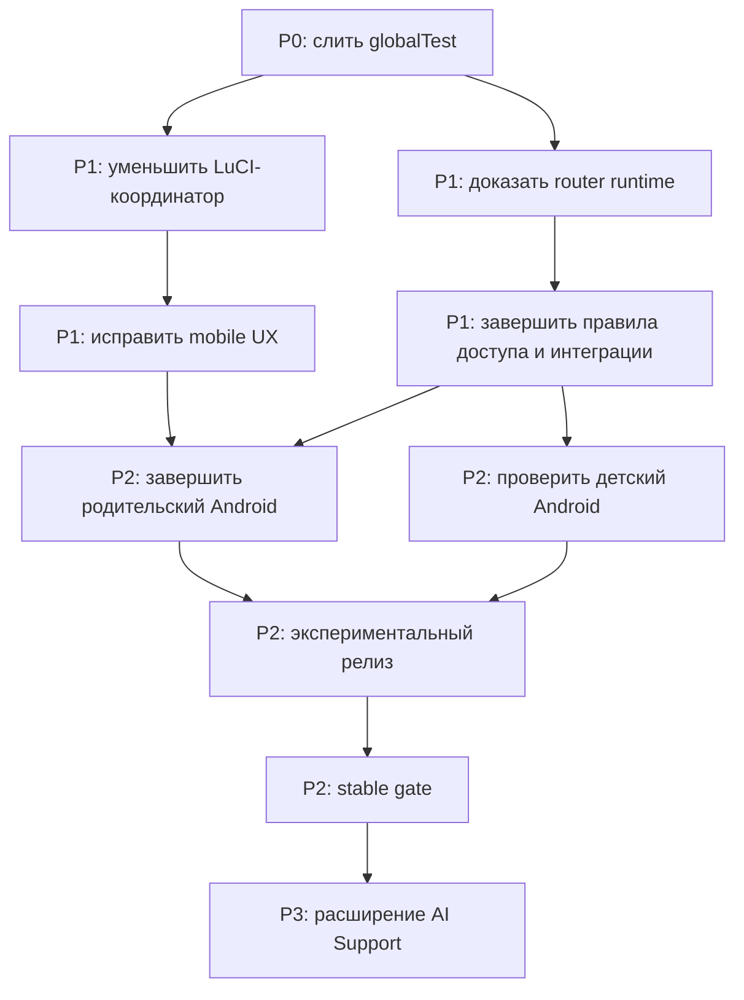

# План дальнейшей разработки Sheepfold

<!-- §roadmap -->

Актуализировано: **21 июля 2026 года**.

Этот документ задаёт порядок дальнейшей работы. Он не заменяет продуктовые требования, профильные документы и ADR: здесь указано, **что делать следующим, почему именно в таком порядке, чем задача должна завершиться и как доказать результат**.

Источники подробного контекста:

- [текущий статус реализации](current-implementation-status.md);
- [открытые вопросы владельцу](owner-open-questions.ru.md) (§ownques);
- [архитектурные решения](architecture/decisions/README.ru.md) (§adrproc);
- [паспорт устройства и управление](device-passport-and-control.ru.md) (§devpas1);
- [проверка готовности к слиянию](merge-readiness-plan.ru.md) (§mrgready);
- [стратегия тестирования](test-strategy.ru.md) (§testcat);
- [модули-помощники качества](quality-assistants/README.ru.md) (§qassist).

## Как читать статусы

| Обозначение | Смысл |
|---|---|
| `P0` | Нельзя откладывать перед следующим крупным слиянием. |
| `P1` | Нужно для надёжной экспериментальной версии и дальнейшей разработки без накопления нового долга. |
| `P2` | Нужно закрыть до заявления о полноценном stable-релизе соответствующего приложения. |
| `P3` | Развитие после стабилизации основного управления интернетом. |
| `Отложено` | Идея сохраняется в документации, но сейчас не забирает время у Standard-ядра. |

`Готово` в этом плане означает не только наличие кода. Нужны ближайший regression-тест, актуальная документация, проверка реального runtime там, где локальный тест его не доказывает, и честное перечисление оставшихся границ.

## Текущая точка

На момент записи плана:

- этап `globalTest` завершён: PR [#3](https://github.com/kva4991/luci-app-sheepfold-family-internet-control/pull/3) слит fast-forward в `main` на commit `c80cd09`, временная ветка удалена;
- версия OpenWrt-пакета в ветке — `0.1.0-r241`;
- локальный строгий quality gate, ESLint, документационный аудит и матрица официальной SDK-сборки прошли;
- Standard и AI Support успешно собираются в форматах IPK для OpenWrt 24.10 и APK v3 для OpenWrt 25.12;
- `r241` установлен и прошёл read-only/backend/LuCI-проверки на тестовом роутере OpenWrt 25.12;
- LuCI не имеет обнаруженного горизонтального переполнения, но mobile-аудит оставляет **109 неблокирующих предупреждений** о слишком маленьких областях нажатия;
- главный координатор [`overview.js`](../package/luci-app-sheepfold-family-internet-control/htdocs/luci-static/resources/view/sheepfold/overview.js) после первого P1-прохода содержит около **4770 строк** при проектном предупреждающем пороге 700;
- наиболее важные неподтверждённые места — реальный трафик через firewall/DNS в разных интеграциях, OpenWrt 24.10 на живом устройстве, физические Android-сценарии и незавершённые Android-редакторы.

Эта точка является базой плана, а не обещанием публичной готовности.

## Главный порядок приоритетов

1. Сначала довести **Standard-ядро без ИИ**: устройства, правила доступа, расписания, firewall, Wi-Fi, журналы, обновление, LuCI и базовый Android-клиент.
2. Затем доказать работу на живом роутере и физических телефонах, включая обновление существующей установки без потери UCI.
3. После этого завершать полноту Android-интерфейсов и готовить экспериментальный релиз.
4. ИИ-документацию продолжать уточнять, если новая задача касается её контрактов, но тяжёлую реализацию памяти, анализа активности и внешнего вычислительного сервера пока не начинать.
5. Новые идеи сначала помещать в [`development-ideas.md`](development-ideas.md). Они входят в активный план только после явного повышения приоритета либо когда устраняют дефект безопасности, потерю данных или непроходимый пользовательский сценарий.

## P0. Завершено: ветка `globalTest`

Статус: **завершено 21 июля 2026 года**. PR #3 слит fast-forward в `main`; локальная и удалённая временные ветки удалены. Полный локальный gate, PR checks, повторные post-merge checks, официальный SDK и живой `r241` прошли.

### Зачем

Ветка добавляет ADR, анализ влияния правок, единый quality gate, pairwise-матрицу, проверку документации, структурный аудит и усиленный browser-аудит. Дальнейшая разработка должна опираться на эти инструменты, а не поддерживать длительное расхождение с `main`.

### Работы

1. Просмотреть `git diff origin/main...globalTest` как единый набор, особенно изменения исполняемого кода, локализации и правил выбора тестов.
2. Обновить [`current-implementation-status.md`](current-implementation-status.md): текущую версию пакета, последнюю доказанную SDK-матрицу и живую проверку `r241`.
3. Повторить `npm.cmd run quality:gate` после последних изменений документации.
4. Убедиться, что GitHub-проверки ветки зелёные и официальный SDK workflow собрал полный комплект из четырёх роутерных пакетов.
5. Повторить как минимум `router:readOnly` и `router:frontend` на установленном `r241`; не переустанавливать пакет без причины.
6. Оформить PR или явное ревью состава, слить ветку в `main` и удалить её только после подтверждённого push обновлённого `main`.

### Критерий завершения

- `main` содержит все три коммита ветки без лишних артефактов;
- `git status --short --branch` чист;
- документация не называет старую версию текущей;
- полный локальный gate, GitHub checks и границы живой проверки записаны рядом с результатом;
- ни один `pendingManualChecks` не исчез из отчёта без фактического запуска или честной пометки.

## P1. Продолжить модульный рефакторинг LuCI

### Зачем

`overview.js` остаётся главным источником риска: одна правка может незаметно затронуть навигацию, UCI, модалки, backend-команды и перерисовку нескольких вкладок. Цель — не механически добиться красивого числа строк, а сделать границы ответственности видимыми и тестируемыми (§frontmod).

### Порядок извлечения

1. **Общие настройки.** Вынести построение полей, чтение/проверку черновика и подготовку payload. Координатору оставить загрузку UCI и единый запуск сохранения.
2. **Навигация и состояние страницы.** Вынести верхние вкладки, вторую строку вкладок настроек, выбранные дочерние вкладки и восстановление текущего экрана после локального обновления данных.
3. **Команды и обратная связь.** Централизовать запуск backend-команд, блокировку повторного клика, обработку `status/errorCode`, toast и локальную перерисовку без полной перезагрузки страницы (§apicon1).
4. **Узкие persistence-адаптеры.** Отделить device/DHCP/firewall, Wi-Fi UCI/reload, backup transaction и pairing operations. Эти адаптеры должны оставаться небольшими и не смешиваться с DOM.
5. **Финальная зачистка координатора.** Удалить только доказанно мёртвые helper-функции и дубли; не менять поведение одновременно с переносом.

Каждый пункт выполнять отдельным небольшим изменением. Новый модуль желательно держать ниже предупреждающего порога `700` строк; превышение допустимо только при цельной ответственности и кратком объяснении в ревью. Сам `overview.js` должен уменьшаться на каждом проходе, но запрещено дробить связанную транзакцию ради счётчика строк.

Прогресс 21 июля 2026 года: первый пункт начат и доведён до самостоятельной границы. `features/settings/general.js` теперь строит вкладку `Общие`, а `features/settings/persistence.js` проверяет черновик, раскладывает его по `global/usb/cloud/gdrive/adguard` и получает UCI/commit только через узкий адаптер. Единый порядок сохранения и runtime side effects пока намеренно остаётся в координаторе. Следующий проход — пункт 2, навигация и состояние страницы (§frontmod).

### Проверки каждого прохода

- ближайшие LuCI contract-тесты;
- `npm.cmd run lint:js`;
- `npm.cmd run test:luci`;
- `npm.cmd run quality:structure`;
- `npm.cmd run router:frontend` после изменения реального DOM, модалки, сохранения или навигации;
- ручная проверка изменяющего действия через UI → API → UCI → runtime, если оно не read-only (§debug01).

### Критерий завершения

Координатор собирает модули и владеет только общим жизненным циклом страницы. Предметный модуль не читает произвольные переменные `overview.js`, не делает скрытый `uci.commit()` и не перезагружает страницу ради обновления одной таблицы.

## P1. Исправить mobile UX и единообразие интерфейса

### Зачем

Отсутствие overflow не означает удобство. На телефоне остаются маленькие сортировки, чекбоксы и действия, по которым занятому пользователю трудно попасть с первого раза (§uxrev01).

### Работы

1. Разобрать 109 предупреждений по типам: сортировка, иконка-действие, чекбокс/радиокнопка, вкладка, вторичная ссылка.
2. Увеличить реальную область нажатия, не обязательно визуальный размер значка: на mobile стремиться к `44 × 44 px`, для плотных desktop-таблиц не опускаться ниже проектного комфортного порога без обоснования.
3. Сохранить одинаковые значок, подпись, tooltip и результат в одинаковых местах LuCI.
4. Проверить длинные русские строки, узкий экран `390 × 844`, desktop `1440 × 900`, модалки и экранную клавиатуру Android.
5. Оставшиеся исключения явно перечислить в browser-отчёте; не понижать порог только ради зелёного результата.

### Критерий завершения

Нет fatal-ошибок, горизонтального переполнения, безымянных кнопок и целей меньше 24 px. Число предупреждений меньше 32 px существенно сокращено, а каждое оставшееся предупреждение имеет понятную причину и не относится к основной пользовательской команде.

## P1. Доказать единый движок правил доступа

### Зачем

Одинаковый статус должен вычисляться одинаково в LuCI, Android API, расписаниях и nftables. Пока приоритет нельзя редактировать безопасно: один UI-переключатель без общего backend-контракта создаст расхождение между показанным и реальным доступом (§84azytj).

### Работы

1. Сверить одну реализацию порядка: аварийно-полезные сайты, группа `Без ограничений`, чёрный список устройств, белый список устройств, глобальное отключение, временный доступ, расписание устройства, расписание группы, обычный доступ.
2. Явно разделить доступ в интернет и безусловную защиту LuCI/SSH/API. Нерешённое несовпадение доверенного отпечатка всегда закрывает управление роутером; настройка автоматического мониторинга влияет только на интернет (§h6mxq4c, §devpas1).
3. Завершить wall-clock тест расписаний: переход через границу времени, ночь, перезагрузка службы, неверное время роутера и конфликт правил одного уровня.
4. Проверить немедленные команды списков устройств: UCI commit, firewall sync и локальное обновление строки без reload всей страницы (§listnoref).
5. Реализовать редактирование `access_priority` только после появления единого парсера/валидатора и миграции. До этого настройка остаётся честно read-only.
6. Добавить диагностический ответ, который объясняет администратору решение, но не раскрывать ребёнку разрешившее правило: детский экран показывает только факт доступа и время следующего изменения.

### Живая матрица

Нужно подтвердить трафиком клиента, а не только содержимым nftables:

- обычный доступ;
- чёрный и белый списки устройств;
- `Без ограничений`;
- глобальное отключение;
- временный доступ и его истечение;
- расписания устройства/группы и конфликт;
- аварийно-полезные сайты;
- firewall reload и перезагрузка службы;
- запрет LuCI/SSH/API для чёрного списка устройств и карантина.

### Критерий завершения

Для каждого сценария совпадают API-статус, LuCI, детский статус и фактический пакетный трафик. После restore отсутствуют тестовые MAC, временные nftables-объекты и непринятые UCI-изменения.

## P1. Закрепить паспорт и распознавание устройств

### Зачем

Классификация типа нужна для удобства, но не должна превращаться в выдачу прав по подделанному имени или MAC. Доверенная идентичность, тип устройства и карточка с постоянным `#ID` остаются разными сущностями (§devpas1, §devident1).

### Работы

1. Проверить событийный запуск на offline → online, один startup-проход и суточный проход только по online-устройствам.
2. Убедиться, что выключенные устройства и чёрный список устройств не получают тяжёлый анализ; для чёрного списка сохраняются только presence и журнал запрещённых попыток.
3. Прогнать реальные фикстуры и устройства: телефоны с privacy MAC, Tuya/ESP smart-home, камера/NVR, Home Assistant, AdGuard Home, Samba/Proxmox, хабы умного дома.
4. Проверить независимость classification hash и trusted identity HMAC, три последних обезличенных снимка доказательств и миграцию старых записей.
5. Подтвердить карантин при сильном несовпадении, суточное дедуплицированное уведомление и отсутствие автоматического переноса прав между MAC.
6. Проверить автогруппы: `Персональные устройства` и `Без ограничений` создаются, не удаляются, назначаются только при включённой автонастройке, ручное удаление из автогруппы не отменяется следующим проходом.
7. Показывать понятный значок качества идентификации и только полезные противоречия, IP и решение, которое требуется от родителя.

### Критерий завершения

Слабые признаки помогают назвать тип, но не выдают доверие. Ручной тип защищён от последующей автоклассификации. Ни одно автоматическое решение не перебивает чёрный список устройств, ручную группу, расписание или подтверждённый отказ от повторного автодобавления.

## P1. Завершить списки сайтов и интеграции

### Зачем

Встроенный движок нужен как самостоятельный минимум и резерв, а AdGuard Home — как более гибкий исполнитель. Sheepfold должен управлять только собственным фильтром и не повреждать Podkop, пользовательские фильтры или DNS-настройки (§dompol, §aghplan).

### Работы

1. На живом стенде проверить четыре режима: без Podkop/AdGuard Home, только Podkop, только AdGuard Home, оба компонента.
2. Подтвердить путь DNS от реального клиента до выбранного исполнителя, а не только наличие фильтра в API AdGuard Home.
3. Проверить last-known-good: повреждённый источник не стирает рабочий список, попытка повторяется через сутки, после трёх ошибок приходит одно уведомление, восстановление тоже сообщается один раз (§slstres).
4. Проверить дедупликацию, лимиты размера/архива, резкое уменьшение списка и десятисекундное подтверждение.
5. Переделать многострочные URL в отдельные записи источников с включением/выключением без удаления.
6. Сохранить отдельное явное согласие для любого будущего изменения глобальной защиты, upstream DNS, клиентов, DHCP, Safe Search или заблокированных сервисов AdGuard Home. Текущий флаг этого не разрешает.
7. Решить вопросы о DoH/VPN/proxy/прямом IP и HTTP-источниках из [`owner-open-questions.ru.md`](owner-open-questions.ru.md) до обещания полной защиты.

### Критерий завершения

Статус в LuCI различает работу, fallback, ожидание и ошибку. Пользовательский фильтр AdGuard Home и состояние Podkop сохраняются. При ошибке обновления остаётся последняя рабочая политика, а rollback подтверждён реальным DNS-запросом.

## P1. Реализовать сохранённые, но пока не исполняемые настройки

### Зачем

Интерфейс уже сохраняет несколько значений, однако фоновые задачи их не исполняют. Такая настройка выглядит рабочей и создаёт ложное ожидание.

### Работы

1. Ограничение размера и срока хранения основного журнала.
2. Очистка записей давно offline-устройств без переиспользования их постоянных `#ID`.
3. Периодическая проверка обновлений согласно выбранному режиму, с отдельным подтверждением установки.
4. Первый запуск country-aware NTP/timezone и безопасное поведение при явно неверном времени.
5. Явная плашка `Полный режим без проверки портов`, если `nmap` не установлен; не устанавливать тяжёлый пакет скрытно.

Каждая задача получает собственный lock, лимит времени/размера, понятный журнал и тест перезагрузки. До реализации соответствующий UI-текст не должен утверждать, что фоновая работа уже выполняется.

## P2. Довести родительский Android до выбранного релизного объёма

### Сначала требуется решение

Вопрос №6 в [`owner-open-questions.ru.md`](owner-open-questions.ru.md) определяет, обязан ли первый stable APK содержать полные редакторы расписаний, групп, администраторов, Wi-Fi и журналов. До ответа можно развивать общий API и экраны, но нельзя честно объявлять полноту Android-клиента.

### Работы

1. Прогнать реальное QR-сопряжение, ручной ввод, автопоиск, загрузку QR из файла, смену порта и повторную привязку после `token_invalid/revoked`.
2. Подтвердить DHCP renewal, Wi-Fi reconnect, переход 2,4/5 ГГц и между mesh-точками без ложного отзыва токена.
3. Реализовать выбранные полноценные вкладки через общий версионируемый API, не копируя LuCI-логику в Kotlin.
4. Добавить auto-lock в фоне и backoff ошибочных PIN/паролей после решений владельца.
5. Решить, могут ли виджеты выполнять глобальную команду без разблокировки; до решения не считать их security-модель завершённой.
6. Запрашивать разрешения Android непосредственно перед функцией, которой они нужны.
7. Настроить production signing вне Git, проверить upgrade debug/test → release только по явно поддерживаемому пути и протестировать минимум два физических телефона.

### Критерий завершения

Временная потеря сети не стирает токен; окончательный `401`, отзыв устройства и mismatch SPKI отправляют только на повторное сопряжение. Одноразовый код не используется повторно. Все основные состояния имеют понятный русский текст без `undefined`, технического stack trace и ложного успеха.

## P2. Довести детский Android до безопасного минимального контракта

### Работы

1. Автопоиск шлюза длится ограниченное время, затем появляется понятный ручной IP и сообщение о возможном подключении к другой Wi-Fi сети.
2. Экран доступа показывает только `Интернет разрешён/отключён` и время следующего реального изменения; название разрешившего правила не показывается.
3. Решить, надо ли убрать `accessMode`, внутреннее сообщение и conflict-details также из публичного `/client-status`, а не только скрыть на экране.
4. Запрашивать SIM/location/nearby-Wi-Fi разрешения только при включении соответствующей функции на роутере.
5. Проверить очередь SIM/Wi-Fi отчётов, лимиты 100 записей, сроки 90 дней, очистку при отзыве настройки и отсутствие фонового облачного трекинга.
6. Запрос `+30 минут` оставить opt-in для конкретного администратора; доставка и решение принадлежат роутеру/родительскому клиенту.

### Критерий завершения

Приложение полезно без облачного сервера, не раскрывает ребёнку внутреннюю политику семьи и не требует лишних разрешений. Недоступный роутер отличается от отключённого интернета и не создаёт ложный статус.

## P2. Эксплуатация: журналы, Telegram, обновление и обратная связь

1. Проверить, что новые события находятся сверху, журналы живут в RAM по умолчанию, секреты не записываются, а маскирование происходит при экспорте.
2. Сделать выбор диапазона экспорта журнала: час, неделя, период, всё время.
3. Завершить Telegram live-тесты: русский алиас `помощь`, список команд, разрешённый ID пользователя, single-use подтверждение опасных команд и multi-admin границы.
4. VK оставить будущим адаптером, MAX — экспериментальной записью; не показывать их как готовые подключения.
5. Проверить updater в обоих package formats: только stable release, сравнение версии, тайм-аут без ложного успеха, backup UCI и честное сообщение о границе binary rollback (§updsafe).
6. Проверить канал отзывов без diagnostic payload по умолчанию; передача диагностики требует явного списка полей и не включает секреты, SSID, журналы посещений или полный UCI (§feedback).

## P2. Подготовить экспериментальный релиз

### Обязательная матрица

- OpenWrt 24.10: чистая установка, обновление, удаление с сохранением настроек;
- OpenWrt 25.12: чистая установка и повторный upgrade уже подтверждённого формата APK v3;
- Standard → AI Support → Standard с сохранением `/etc/config/sheepfold`;
- без интеграций, AdGuard Home, Podkop, AdGuard Home + Podkop;
- русский и английский интерфейс, базовая проверка китайского каталога;
- родительский и детский Android на физических устройствах;
- backup/restore на том же и новом роутере;
- reboot, firewall reload, смена DHCP IP, смена порта Sheepfold и обновление пакета.

### Release gate

1. `npm.cmd run quality:gate` без неизвестных путей и скрытых partial-статусов.
2. Android Lint и release-сборки обоих APK.
3. Официальный GitHub SDK workflow формирует полный комплект и SHA256SUMS.
4. `router:readOnly`, `router:fullSafe`, `router:runtimeMatrix` и `router:frontend` проходят на поддерживаемых стендах.
5. Нет незакрытого дефекта, который даёт ребёнку административный доступ, обходит чёрный список устройств, теряет UCI или показывает успех без runtime-применения.
6. Release notes прямо перечисляют экспериментальные ограничения; debug APK не выдаётся за stable.

Сборочные файлы не копировать в `C:\Users\User\Documents\pesochnica` после каждой правки. Делать это только по прямой просьбе владельца; при копировании удалять прежние версии того же типа.

## P3. Работы после первого надёжного релиза

- стабильный `/api/v1/*`, capability negotiation и продуманная схема refresh/revoke токенов;
- расширенные Android-редакторы, если они не вошли в первый релиз;
- VK, затем оценка MAX;
- голосовые помощники только через отдельный threat model и явное подтверждение опасных команд;
- ручное объединение нескольких записей одного физического устройства с полным переносом только после подтверждения владельца;
- дополнительные модели роутеров, country profiles и аппаратные WPS/LED сценарии;
- улучшение справки `?` для неочевидных настроек;
- новые функции из [`development-ideas.md`](development-ideas.md) после отдельной оценки стоимости, приватности и нагрузки на роутер.

## Отложено. ИИ-помощник

Документация ИИ-помощника остаётся важной частью проекта, но текущий приоритет — работоспособность IPK без ИИ. Когда Standard-ядро пройдёт release gate, работа продолжается по [`ai-assistant-development/implementation-roadmap.ru.md`](ai-assistant-development/implementation-roadmap.ru.md) (§airoad1).

До этого разрешены только:

- исправление противоречий в AI-документации;
- поддержание границы Standard/AI Support;
- security/privacy фиксы уже существующего router proxy;
- тесты, не превращающие будущую идею в заявленную готовую функцию.

Не начинать пока тяжёлую долговременную память, анализ истории активности, внешний вычислительный сервер, автоматическую передачу семейных данных или кризисные уведомления без отдельного threat model, согласия и подтверждённого протокола минимизации данных.

## Решения владельца, блокирующие отдельные этапы

Полный список и объяснения находятся в [`owner-open-questions.ru.md`](owner-open-questions.ru.md) (§ownques). Следующими полезнее всего закрыть:

| Вопрос | Когда нужен ответ | Почему |
|---|---|---|
| №6. Объём первого родительского APK | до фиксации Android release scope | Определяет, являются ли вкладки-заглушки blocker или допустимым ограничением beta. |
| №7. Поддерживаемые OpenWrt и второй роутер | до stable gate | Один OpenWrt 25.12 роутер не доказывает 24.10 и разнообразие железа. |
| №14. Минимизация `/client-status` | до child API freeze | Скрытие только в UI не убирает лишние данные из сети. |
| №17–18. Auto-lock и виджеты | до Android security freeze | Определяют, может ли команда выполниться без повторной проверки владельца. |
| №21. Production signing | до распространения APK | Без постоянного закрытого ключа нельзя безопасно обновлять установленное приложение. |
| №22–25. Страны, время и автообновление | до первого stable | Ошибка времени ломает расписания; автоматическое обновление меняет риск эксплуатации. |
| №26. Доступ обычных устройств к роутеру | до окончательной firewall-политики | Нужно разделить удобство домашней сети и защиту управления. |
| №29. Размер журнала | до фоновой ротации | Определяет предел RAM и поведение при заполнении. |
| №30–31. Первый site allowlist и полный detector без `nmap` | до installer freeze | Нужны честные defaults для безопасной установки на слабом роутере. |

Не блокирующие текущий рефакторинг вопросы решаются перед соответствующим этапом, а не все сразу.

## Рабочий цикл каждого изменения

1. Прочитать `AGENTS.md`, этот план и профильный документ/ADR по §-тегу.
2. Выполнить `npm.cmd run quality:plan` и записать ручные проверки до начала правки.
3. Сделать один логически цельный проход без попутного расширения функций.
4. Запустить ближайший тест и `quality:changed`.
5. Для исполняемого кода перед push запустить `quality:gate`; Android, GitHub SDK и живой роутер остаются отдельными доказательствами.
6. Проверить не только toast, но цепочку UI → API → UCI → runtime (§debug01).
7. Обновить профильный документ, текущий статус и §-теги в той же правке.
8. В итоговом сообщении назвать: изменённый контракт, прошедшие проверки, непройденные проверки и следующий безопасный шаг.

## Что сейчас не делать

- не добавлять новые тяжёлые зависимости на роутер без измерения размера, RAM, CPU и fallback;
- не расширять полномочия Sheepfold над AdGuard Home под существующим флагом согласия;
- не менять маршруты, packet marks или таблицы Podkop;
- не переносить права между похожими устройствами автоматически;
- не считать MAC, hostname, OUI или открытый порт доказательством личности;
- не обещать защиту от DoH/VPN/proxy/прямого IP, пока она не реализована и не проверена;
- не смешивать рефакторинг большого файла с новым пользовательским поведением;
- не объявлять функцию готовой по статическому тесту, toast или одному скриншоту;
- не тратить текущий цикл на реализацию большой AI-архитектуры вместо Standard-ядра.

## Как поддерживать этот план

После каждого завершённого этапа:

1. обновить дату и текущую точку;
2. перенести доказанный результат в [`current-implementation-status.md`](current-implementation-status.md);
3. убрать выполненный пункт либо пометить его завершённым с ссылкой на commit/тест, не оставляя двусмысленное настоящее время;
4. новые продуктовые идеи сначала отправлять в [`development-ideas.md`](development-ideas.md), а не вставлять между активными `P0/P1`;
5. при изменении архитектурного решения создать новый ADR, а не переписывать историю (§adrproc).
