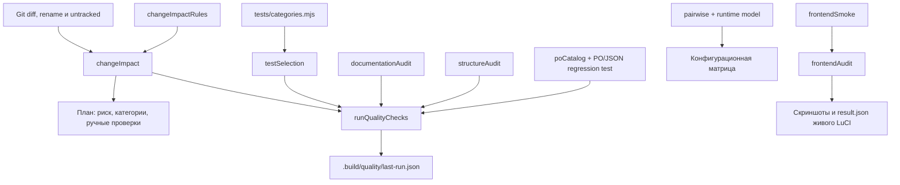

# Модули-помощники для поиска ошибок

<!-- §qassist -->

Этот раздел описывает локальные детерминированные инструменты Sheepfold. Они помогают новому агенту быстро ответить на четыре вопроса:

1. Какие подсистемы действительно затронуты изменением?
2. Какой минимальный набор проверок даст полезную обратную связь сейчас?
3. Какие дорогие или изменяющие внешнее состояние проверки ещё остаются обязательными?
4. Не ухудшил ли рефакторинг документацию, структуру файлов или LuCI на настоящем роутере?

Инструменты не используют внешнюю LLM, не отправляют исходники в облако и не добавляют runtime-зависимости в роутерный пакет. Для локальных анализаторов достаточно Node.js и уже закреплённых devDependencies. Playwright ставится существующим router harness в `tools/local/` и не попадает в IPK.

## Первые команды нового агента

Из корня репозитория на Windows:

```powershell
git status --short --branch
npm.cmd ci
npm.cmd run quality:plan
```

`npm.cmd ci` нужен только если отсутствует `node_modules` либо изменился lock-файл. Он не требуется перед каждым запуском.

Во время разработки:

```powershell
npm.cmd run quality:changed
```

Перед push после изменения исполняемого кода:

```powershell
npm.cmd run quality:gate
```

`quality:gate` запускает полный Node-набор и строгую проверку неизвестных карте путей. Он не запускает живой роутер, GitHub Actions и сборку Android APK: такие команды перечисляются в отчёте как отдельные обязательства, потому что могут менять внешнее состояние или требуют специального окружения.

## Карта инструментов

| Задача | Команда | Скорость | Меняет внешнее состояние |
| --- | --- | --- | --- |
| Только посмотреть риск и план | `npm.cmd run quality:plan` | секунды | нет |
| Посмотреть карту вручную | `npm.cmd run review:impact` | секунды | нет |
| Запустить минимальные проверки | `npm.cmd run quality:changed` | обычно секунды или минуты | только `.build/quality/last-run.json` |
| Строгий локальный gate | `npm.cmd run quality:gate` | полный suite может идти более 10 минут | только локальный отчёт и test temp |
| Проверить изменённые документы | `npm.cmd run quality:docs` | секунды | нет |
| Проверить все документы | `npm.cmd run quality:docs:all` | секунды | нет |
| Найти рост крупных файлов | `npm.cmd run quality:structure` | секунды | нет |
| Вывести all-pairs матрицу | `npm.cmd run quality:matrix` | доли секунды | нет |
| Проверить LuCI на роутере | `npm.cmd run router:frontend` | десятки секунд | read-only сессия LuCI, локальные артефакты |

## Как модули связаны



## Что включать в зависимости от задачи

| Изменение | Минимум во время работы | Перед завершением |
| --- | --- | --- |
| Только текст документа | `quality:docs`, ближайший контрактный тест | `git diff --check`; полный suite обычно не нужен |
| LuCI JS/CSS | `quality:changed`, затем `test:luci` при необходимости | `lint:js`, `router:frontend`, полный suite перед push |
| Backend helper | `quality:changed`, обычно `backendFast` | полный suite; `router:readOnly` либо `router:fullSafe` по отчёту |
| Firewall/DNS/AdGuard | ближайший unit/runtime-тест | полный suite, `router:fullSafe`, при необходимости `router:runtimeMatrix` |
| Android Kotlin/XML | `test:android`, Android Lint | сборка затронутого APK и сценарий эмулятора/телефона |
| UCI/defaults/package | `backendFast packaging security` | полный suite, живой upgrade/restore и официальный SDK build |
| Только тестовая инфраструктура | `quality:changed` | полный suite, потому что менялся способ получения доказательств |

## Значение итоговых статусов

- `passed`: все автоматически выбранные локальные проверки пройдены.
- `partial`: выбранные проверки пройдены, но общий контракт требует полного suite либо Android Lint был явно пропущен.
- `failed`: упал lint/test/docs/diff-check или строгий режим встретил неизвестный путь.
- `pendingManualChecks`: команды для живого роутера, Android build или GitHub SDK. Они не выполнены автоматически и не должны исчезать из итогового отчёта агента.

Зелёный локальный статус не доказывает работу Wi-Fi, nftables, DNS, Android lifecycle или установки на конкретной модели OpenWrt. Граница доказательства всегда указывается рядом с инструментом.

## Файлы реализации

| Файл | Ответственность |
| --- | --- |
| `tools/quality/changeImpactRules.mjs` | единственная карта путей, риска, категорий и внешних проверок |
| `tools/quality/changeImpact.mjs` | чистая агрегация отчёта без Git и subprocess |
| `tools/quality/gitChanges.mjs` | tracked, untracked, delete и обе стороны rename |
| `scripts/inspectChangeImpact.mjs` | CLI для просмотра и JSON |
| `scripts/runQualityChecks.mjs` | последовательный локальный gate и измерение этапов |
| `tools/quality/testSelection.mjs` | объединение категорий и точечных тестов без дублей |
| `tools/quality/documentationAudit.mjs` | относительные Markdown-ссылки и §-теги |
| `tools/quality/whitespaceAudit.mjs` | пробелы и окончание строк, включая ещё не добавленные в Git файлы |
| `tools/quality/structureAudit.mjs` | рост крупных изменённых файлов относительно Git-базы |
| `tools/quality/poCatalog.mjs` | строгий разбор PO для сверки исходного каталога с клиентским JSON без дочернего Python |
| `tools/quality/pairwise.mjs` | детерминированное покрытие допустимых пар конфигурации |
| `tools/router-testing/frontendAudit.mjs` | чистые read-only проверки страницы LuCI |
| `tools/router-testing/frontendSmoke.mjs` | запуск браузера и запись артефактов |

Подробности: [карта влияния и gate](change-impact-and-gate.ru.md), [документация, структура, матрица и LuCI](matrix-structure-and-ui.ru.md).

## Когда расширять инструменты

Новая подсистема требует обновления `changeImpactRules.mjs`, если её путь не попадает в существующую предметную область или ей нужна особая живая проверка. Новая тестовая категория добавляется только при устойчиво отдельном типе проблем, а не ради одного файла. Новый сканер принимается, только если он ловит конкретный класс ошибок лучше существующего ESLint/test/harness и его стоимость измерена.

Не добавлять целиком внешние коллекции skills, AI-slop scanners и MCP-обёртки «на всякий случай». Репозиторий должен сохранять воспроизводимый локальный контур, понятный без стороннего аккаунта и сетевого сервиса.
