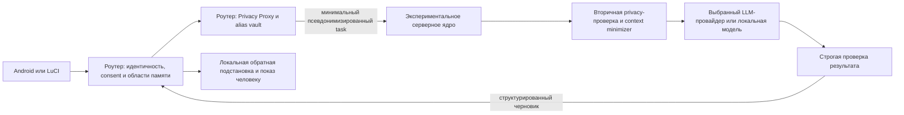

# Поток данных и границы приватности

<!-- §aisrvexp1 -->

## Главный инвариант

Выделенный сервер не является первым рубежом приватности. Пароли, токены, реальные имена, MAC, IP, SSID и обратная карта псевдонимов удаляются или заменяются на роутере **до** первого внешнего сетевого перехода. Серверная проверка может остановить дальнейшую отправку провайдеру, но не способна отменить уже состоявшуюся передачу серверу.

Этот документ уточняет эксперимент и наследует более строгий контракт [`privacy-proxy-and-external-compute.ru.md`](../../../docs/ai-assistant-development/privacy-proxy-and-external-compute.ru.md). При расхождении канонический документ имеет приоритет.

## Зоны доверия

### Домашняя зона

На роутере остаются реальные идентификаторы, полная память, ключи, согласия, UCI, firewall и окончательное право выполнить действие. Даже домашний worker в LAN получает минимизированный payload: нахождение в домашней сети не делает лишние данные необходимыми.

### Сервер Sheepfold

Сервер получает непрозрачные `tenantId`, `sessionId` и псевдонимы, ограниченные задачей или назначением. Он может хранить только те данные, которые нужны выбранному режиму и сроку. Он не получает обратную карту имён, административный токен роутера, MAC/IP и право входить в домашнюю сеть.

### Провайдер модели

Провайдер является ещё одним внешним получателем. Перед ним сервер повторно минимизирует контекст, исключает технические метаданные и применяет его актуальную политику хранения. Использование внешнего API показывается пользователю честно; псевдонимизация не называется анонимизацией.

## Контракт входящей задачи

Внешний `signedTask` содержит только версию transport и compact JWS. Весь JOSE header compact-формы защищён подписью; обязательны `alg`, `kid`, `typ` и `cty`. Неподдерживаемый `alg`, `alg=none`, неизвестный critical header и нестандартный unencoded payload запрещены.

Подписанный JWS payload является `requestEnvelope` и содержит:

- версию схемы, одноразовый `requestId`, `issuedAt` и `expiresAt`;
- непрозрачные идентификаторы tenant/session без локального смысла;
- возрастной диапазон, локаль и профиль страны;
- уже минимизированные сообщение и короткую историю;
- серверную область обработки `oneOff` либо `longitudinal`; задача `local` не покидает домашнюю зону и серверной схемой отклоняется;
- явную цель обработки и идентификатор выбранного provider/worker;
- доказательство разрешённого режима передачи без текста согласия, связанное с целью, provider и классом данных;
- доказательство выполненной локальной минимизации;
- разрешённые области памяти и серверно установленный режим действий.

`kid` и подпись не лежат внутри подписываемого payload: это устраняет самоссылку «подпись подписывает саму себя». `ingressGuard` сначала проверяет подпись точных байтов JWS и protected metadata, а лишь затем декодирует UTF-8 JSON. Разбор запрещает повторяющиеся ключи, `NaN`/`Infinity`, одиночные Unicode surrogate, лишний текст, чрезмерную глубину и неизвестные поля полной схемы. Пересериализовать JSON до проверки подписи нельзя: два парсера могут понять неоднозначный документ по-разному.

После разбора guard проверяет возраст и срок задачи, повтор `requestId`, разрешённую пару tenant/key и scope. Replay-ключ имеет вид tenant + request ID; `kid` проверяет полномочие подписи, но не создаёт новое пространство nonce при ротации ключей. `providerRouteGuard` до любого model port подтверждает, что signed `providerId` совпадает с реально настроенным получателем. Затем сервер отклоняет отсутствующее доказательство режима/минимизации, несовпадающие purpose/provider, чрезмерный размер и очевидно неочищенный секрет. Вторичный detector возвращает только коды нарушений и не записывает найденное значение в журнал. Он является защитной сеткой и сигналом для локального Privacy Proxy, а не обещанием найти все персональные данные.

Compact JWS даёт целостность и подтверждение отправителя, но не шифрует payload. Транспорт остаётся только HTTPS с проверкой сертификата. В первом прототипе один запрос разрешает одного внешнего provider; второй облачный reviewer является новым получателем и требует отдельного preview/receipt.

## Минимизация контекста модели

После приёма `contextMinimizer` создаёт отдельный `modelContext`. В него не входят request/tenant/session ID, provider ID, consent/privacy proof, технические пометки, сетевые адреса, права действий и поля, не нужные выбранному предметному модулю. Цель обработки остаётся, чтобы предметный модуль не мог незаметно расширить назначение данных. Модельные порты и поиск в общей курируемой библиотеке принимают `modelContext`, а не полный `requestEnvelope`; семейная память в эту библиотеку не попадает.

Для риска сначала допускаются локальные детерминированные признаки. Если используется модельный классификатор, он получает тот же минимизированный контекст. Нельзя отправить полный запрос одному провайдеру «только для маскирования» перед отправкой другому.

После интерпретации предметный домен сравнивается с подписанным `processingPurpose`. Несовпадение останавливает retrieval и предметный ответ и предлагает человеку явно перейти в другой режим. Исключение существует только для короткого safety-маршрута: обнаруженная непосредственная опасность не должна исчезать из-за того, что разговор начинался как учебный или технический.

## Согласие и preview

- обычное согласие на выбранного провайдера и понятные категории обработки хранится как версионированная запись на роутере;
- передача нового чувствительного класса либо новому получателю требует отдельного понятного preview;
- отказ от необязательной передачи не лишает ребёнка базового доступа к не-AI функциям Sheepfold;
- `consentProof` подтверждает серверу разрешённый маршрут, но не раскрывает подпись, имя или текст согласия;
- сервер не принимает фразу пользователя внутри чата за изменение consent.

Конкретное правовое основание, возраст самостоятельного согласия и участие опекуна определяются отдельно для каждой страны. Архитектурный receipt не заменяет юридическую проверку.

## Хранение и удаление

- техническая telemetry не содержит текст диалога по умолчанию;
- `oneOff` payload удаляется после ответа и короткого технического окна, заданного политикой;
- `longitudinal` разрешается только для выбранной памяти и стабильного per-purpose псевдонима;
- производные резюме и embeddings наследуют tenant, visibility, provenance и срок исходника;
- удаление охватывает очередь, кэш, индекс, производные и резервные копии по их документированному сроку;
- сервер не использует семейные разговоры для общего fine-tuning по умолчанию.

## Отказоустойчивость

Недоступность сервера или модели не меняет firewall и не открывает дополнительные данные. Ожидаемый отказ model/retrieval adapter преобразуется в типизированный `PipelinePortError`: оркестратор отбрасывает частичный draft и возвращает статический fallback без текста исключения. Это ещё не реализует timeout, retry или circuit breaker конкретного provider. Текущий каркас не повторно обрабатывает тот же `requestId`. Production retry сможет вернуть ранее сохранённый результат только после отдельного проекта короткоживущего result/idempotency store; он не должен второй раз вызывать модель. Действие и запись памяти всегда являются отдельными локально подтверждаемыми операциями со своими idempotency key.
