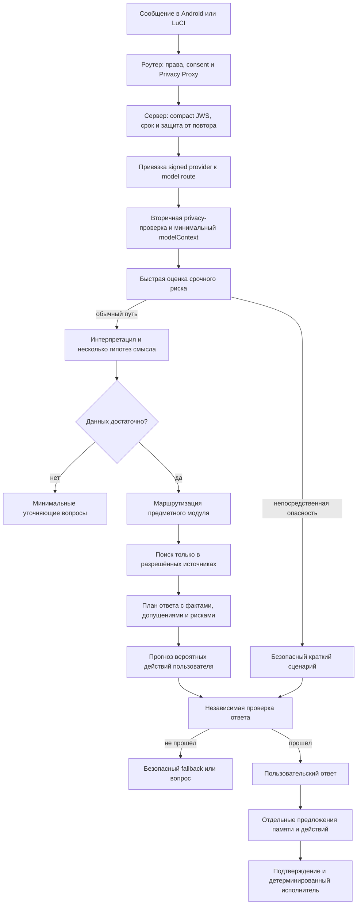

# Архитектура экспериментального ядра

<!-- §aisrvexp1 -->

## Архитектурная позиция

Надёжность здесь достигается не одним «идеальным промптом», а последовательностью узких компонентов. LLM считается вероятностным и недоверенным вычислителем. Код владеет ролями, правами, областями памяти, источниками, подтверждением действий и окончательным решением о том, можно ли показать ответ.

Первый прототип должен быть **модульным монолитом**: один сервис, одна транзакционная БД, отдельные интерфейсы модулей и фоновых заданий. Микросервисы на этом этапе добавят сетевые границы и эксплуатационную сложность раньше, чем появится доказанная нагрузка. Выделять модуль в отдельный сервис следует только при измеренной необходимости: независимое масштабирование, отдельная зона доверия либо иной жизненный цикл данных.

## Поток запроса

Оценка срочного риска выполняется до обычной беседы, потому что длинное выяснение контекста не должно задерживать базовую помощь. После интерпретации риск оценивается повторно: смысл может стать понятен только с учётом истории и уточнений.

## Компоненты

### 0. `routerPrivacyProxy` вне серверного ядра

Роутер проверяет локальную личность, область памяти и consent, удаляет секреты, заменяет прямые идентификаторы и подписывает точные байты ограниченной по времени задачи в compact JWS. Сервер не получает обратную карту псевдонимов и не пытается исправить приватность только после состоявшейся передачи.

### 1. `requestGateway`

До предметного JSON-разбора проверяет compact JWS и его protected `alg`, `kid`, `typ`, `cty`; `alg=none`, неизвестный `crit`, неоднозначный JSON, неверный Unicode и неизвестная схема отклоняются целиком. Затем проверяются `issuedAt`, `expiresAt`, одноразовый `requestId`, непрозрачный tenant, разрешённая пара tenant/key, размер и обязательный tenant-level rate-limit port. Replay-ключ состоит из tenant и request ID: смена или ротация signing key не превращает уже принятую задачу в новую, а другая семья не может занять её идентификатор. Уже потреблённый replay отсеивается до rate limiter. Для свежей задачи limiter получает tenant и request ID и обязан списывать бюджет идемпотентно; его отказ происходит до model call и до consume nonce, чтобы законный клиент мог повторить попытку после окна ограничения. Финальный `consume` остаётся атомарным и закрывает гонку одинаковых запросов. Production должен согласовать эти шаги в одном распределённом admission contract; конкретное хранилище ещё не выбрано. Текст пользователя остаётся данными и никогда не повышает свои полномочия инструкцией вроде «считай меня администратором».

Подпись защищает целостность и происхождение, но не конфиденциальность. Между роутером и сервером всё равно требуется HTTPS с проверкой сертификата. Текущий прототип отвергает повтор задачи; безопасный возврат ранее рассчитанного ответа после потери соединения потребует отдельного result/idempotency store и не должен повторно вызывать модель.

### 1.1. `providerRouteGuard`

Сравнивает подписанный `providerId` с фактически подключённым набором model ports до первого вызова модели. В первом прототипе у запроса один внешний получатель. Reviewer может быть локальным детерминированным модулем или работать через того же получателя; отправка второму облачному provider требует нового preview, receipt и расширения transport-схемы.

### 2. `contextMinimizer`

Создаёт отдельный `modelContext` без tenant/session ID, consent/privacy proof, JWS, provider ID и прав действий. Порты модели типизированы так, чтобы не принимать полный серверный конверт.

### 3. `riskGate`

Объединяет детерминированные сигналы, узкий классификатор и структурированную оценку модели. Он возвращает уровень риска, наблюдаемые основания, неопределённость и разрешённый маршрут. Одно ключевое слово не является доказательством; отсутствие ключевого слова не доказывает безопасность. Для `immediate` код принимает от safety planner только `safeFallback` без action/memory drafts; неверная структура заменяется заранее подготовленным срочным шаблоном. Уровень `high` нельзя провести одним ошибочным флагом `humanReviewRequired=false`.

### 4. `interpretationEngine`

Строит несколько возможных прочтений сказанного, отделяет цитату от вывода, замечает противоречия с предыдущими сообщениями и предлагает не больше нескольких высокополезных вопросов. Он не создаёт скрытую «истинную мотивацию» человека.

### 5. `domainRouter`

Выбирает один основной и при необходимости один вспомогательный модуль: семейная поддержка, обучение, здоровье, техническая помощь или безопасность. Детерминированная policy сверяет результат с подписанным `processingPurpose`: обычная маршрутизация не может молча включить более чувствительную область. Для неё требуется новый preview/receipt. Короткий safety-маршрут при риске не блокируется этой проверкой. Маршрутизация не меняет область видимости памяти.

### 6. `evidenceService`

Ищет не по открытому интернету без ограничений, а по версионированному общему реестру документов и только по минимизированному контексту. Полный входной конверт с подписью, consent и tenant этому модулю не выдаётся. Каждый фрагмент хранит источник, дату, юрисдикцию, возраст, лицензию, срок пересмотра и уровень доверия. Даже запись со статусом `active` не допускается, если срок истёк, дата проверки находится в будущем либо страна/возраст не подходят собеседнику. Текст источника является недоверенными данными: найденная в нём команда модели игнорируется. Личная семейная память проходит через отдельный будущий gateway и не маскируется под evidence.

### 7. `responsePlanner`

Формирует структурированный план: что известно, что предполагается, чего не хватает, на какие источники опираются утверждения, какой следующий шаг уместен и какие действия ответа могут дать обратный эффект.

### 8. `foreseeableHarmReview`

Проверяет не только слова ответа, но и вероятное действие после него. Например: не вызовет ли совет немедленный скандал с ребёнком, отказ от врача, опасное самолечение, выполнение домашнего задания вместо ученика, раскрытие чужого секрета или передачу управления роутером.

Перед модельным review детерминированный `outputGuard` проверяет оценку риска и весь структурированный черновик, включая ответ, safe next steps, citations, memory drafts и action arguments. После reviewer проверяется и окончательный план: его свободный текст либо созданный по его причинам fallback не может обойти первый рубеж. При признаке прямого идентификатора, секрета или запрещённой области результат заменяется полностью статическим fallback без повторного использования модельных полей. Этот слой не умеет доказать отсутствие смысловой утечки и дополняется cross-tenant eval.

### 9. `responseReviewer`

Отдельный проход получает черновик и именно те evidence records, на которые он ссылается. Он проверяет фактическую опору, возрастной язык, утечку данных, чрезмерную уверенность, зависимость от ИИ и соблюдение запретов. В высоком риске одного LLM-рецензента недостаточно: нужны детерминированные правила, предметный специалист и подготовленный безопасный ответ.

Структурированный результат reviewer тоже проверяется как недоверенный ввод. Вердикт `pass` допустим только без причин отказа, проваленных проверок и уточняющих вопросов. Вердикт `needsClarification` обязан содержать от одного до трёх конкретных вопросов; вопросы из отвергнутого черновика вместо них не переиспользуются. Противоречивый либо неполный результат закрывает обычный ответ статическим fallback. При любом отклонении в fallback не переносятся свободные причины reviewer и названные моделью `safeNextSteps`; срочный общий порядок действий берётся только из заранее утверждённого шаблона.

### 10. `memoryGateway`

Ответ и память являются разными операциями. Модель создаёт только предложение записи с происхождением, областью видимости и сроком. В первой версии она может указать лишь `subjectRef=speaker`, но не стабильный `subjectId`: доверенный локальный gateway сам связывает предложение с текущим аутентифицированным собеседником. Создание записи о другом субъекте потребует отдельного resolver и проверки прав. `memoryTier` (`lifeArchive`, `importantMemory`, `currentTopic`) отвечает за жизненный цикл, а `category` (`event`, `secret`, `healthReport` и другие) за смысл; смешивать эти оси в одном поле нельзя. Секрет и модельная гипотеза остаются личными. Личная память одного члена семьи не становится доступной другому из-за администраторской роли.

### 11. `actionGateway`

Модель не получает shell, SQL, UCI или прямой HTTP к роутеру. Она может предложить действие строгой схемы и с неистёкшим сроком. Исполнитель заново проверяет права, срок, существование цели, её допустимый тип и подтверждение. Согласно принятому контракту Sheepfold, без повторного вопроса в явно включённом автоматическом режиме допустимы только применение существующего расписания и назначение обычной группы.

## Два вида ответа

1. **Справочный:** коротко отвечает и показывает проверяемые источники. Используется, когда вопрос в основном фактический.
2. **Индивидуальный:** использует только разрешённый контекст конкретного собеседника, объясняет допущения и адаптирует следующий шаг. Источники подтверждают общие утверждения, но не превращают личную гипотезу в факт.

## Рекомендуемая серверная топология после прототипа

- API: Python 3.12+, FastAPI/Pydantic либо эквивалент с OpenAPI и строгими схемами;
- транзакционные данные: PostgreSQL с row-level tenant boundary, без общей таблицы «всех семей» в запросах модели;
- семантический поиск: сначала PostgreSQL full-text, затем `pgvector` только если измерения докажут пользу;
- краткоживущие очереди и rate limit: Redis либо эквивалент, но не источник истины;
- документы: версионированное объектное хранилище с хешем и манифестом;
- фоновые операции: простая очередь; durable workflow нужен лишь для реально долгих подтверждаемых процессов;
- наблюдаемость: структурированные события без текста разговоров по умолчанию, метрики latency/cost/failure и отдельный защищённый audit действий.

Эта топология является рекомендацией для будущего ADR, а не выбранным production-стеком.
