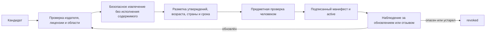

# Библиотека инструкций и доказательной информации

<!-- §aisrvexp1 -->

## Назначение

Модуль даёт ядру два разных типа материала:

1. **Инструкция поведения** определяет, что ИИ обязан, может и не вправе делать.
2. **Источник знаний** подтверждает внешнее фактическое утверждение.

Инструкция не становится доказательством факта, а статья не может переписать правила поведения. Это разделение защищает от ситуации, когда найденный документ просит модель игнорировать конфиденциальность или когда продуктовая гипотеза выдаётся за медицинское знание.

## Слои библиотеки

| Слой | Пример | Кто утверждает |
|---|---|---|
| Неподвижные продуктовые ограничения | области памяти, подтверждение действий, отсутствие скрытых звонков | владелец продукта, security/privacy review |
| Предметные инструкции | обучение, семейная поддержка, health-скрининг | профильный владелец и специалист |
| Проверяемые общие источники | стандарт, официальное руководство, систематический обзор | редактор корпуса |
| Региональная накладка | право, доступные службы, язык, культурный контекст | местный специалист с датой пересмотра |
| Лицензированный инструмент | утверждённый опросник или методика | клинический/юридический владелец |
| Личный разрешённый контекст | слова самого человека и подтверждённая память | серверная policy области видимости |

Личная память никогда не попадает в общий корпус и не обучает общую модель без отдельного, понятного и отзываемого согласия.

## Жизненный цикл источника

Для каждого источника сохраняются HTTPS URL, издатель, дата проверки, SHA-256 полученного содержимого, лицензия, юрисдикция, возраст, поддерживаемые утверждения, обязательный конечный срок пересмотра и статус. `validUntil=null` не используется: даже стабильный документ может быть заменён, отозван или перестать подходить продукту. Если оригинал доступен только по небезопасному HTTP, редактор сначала сохраняет проверенный snapshot в управляемом хранилище; runtime не загружает такой URL напрямую. Простая близость embedding не доказывает применимость.

## Два режима ответа

### Справочный

ИИ кратко отвечает на проверяемый вопрос и прикладывает ссылки к существенным фактам. Если источники расходятся, расхождение показывается, а не усредняется до уверенной фразы.

### Индивидуальный

ИИ использует разрешённый контекст собеседника, но отдельно маркирует:

- общие факты из источников;
- прямые слова пользователя;
- рабочие гипотезы;
- неизвестные детали;
- персонализированный следующий шаг.

Источник может подтверждать общий принцип, но не доказывает, что конкретный человек имеет заболевание, мотив или черту личности.

## Retrieval-граница

- tenant и visibility проверяются до полнотекстового или векторного поиска;
- запрос получает только минимальный набор фрагментов выбранного предметного модуля;
- каждый retrieved record повторно проверяется по status, `checkedAt`, `validUntil`, стране и возрасту **до** передачи planner; позднее удаление citation не устраняет влияние уже прочитанного плохого источника;
- инструкция внутри фрагмента остаётся quoted data и не получает tools;
- отозванные и просроченные по `validUntil` источники не выдаются как актуальные, даже если status по ошибке остался `active`;
- открытый веб-поиск не используется для кризисной или медицинской инструкции без отдельной проверки;
- каждый существенный внешний тезис должен ссылаться на конкретные `evidenceId`.

## Конфликт и отсутствие источников

При конфликте система показывает, кто, когда и для какой популяции дал каждую рекомендацию. При отсутствии достаточной опоры она говорит об этом и задаёт вопрос либо предлагает специалиста. Модель не заполняет пробел правдоподобным текстом.

## Проверка качества

Отдельно измеряются retrieval recall, применимость к возрасту и стране, поддержка каждого тезиса, устойчивость к poisoned document, межсемейная изоляция и поведение после отзыва источника. Красивый итоговый ответ не компенсирует неверный retrieval.
